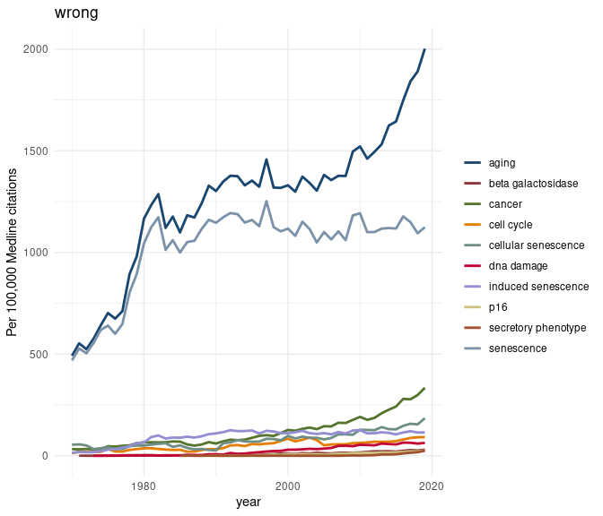

PubMed Mining Toolkit: an overview
----------------------------------

-   [PubMed Mining Toolkit: an
    overview](#pubmed-mining-toolkit:-an-overview)
-   [Installation](#installation)
-   [Usage](#usage)
    -   [MeSH vocabulary](#mesh-vocabulary)
    -   [Search the PubMed database:
        `pmtk_search_pubmed()`](#search-the-pubmed-database:-%60pmtk_search_pubmed()%60)
    -   [Advanced counting](#advanced-counting)
    -   [Fetch abstract data from
        PubMed](#fetch-abstract-data-from-pubmed)
        -   [Download batch data:
            `pmtk_download_abs()`](#download-batch-data:-%60pmtk_download_abs()%60)
        -   [Load batch data:
            `pmtk_loadr_abs()`](#load-batch-data:-%60pmtk_loadr_abs()%60)
        -   [Record details](#record-details)
    -   [Trend data:](#trend-data:)
    -   [MeSH classifications](#mesh-classifications)
    -   [MeSH-based topic model](#mesh-based-topic-model)
    -   [Topic model summary: html
        widget](#topic-model-summary:-html-widget)

Installation
------------

``` r
devtools::install_github("jaytimm/PubmedMTK")
```

Usage
-----

``` r
working_dir <- '/home/jtimm/jt_work/GitHub/PubmedMTK/data-raw/'

if (!require("pacman")) install.packages("pacman")
pacman::p_load(data.table, # quanteda, 
               rentrez, 
               XML, xml2, RCurl,
               reshape2, #text2vec,  
               tokenizers, 
               tm,
               tidytext,
               Matrix.utils,
               janitor,
               ggplot2, knitr,
               magrittr, dplyr, tidyr)
```

``` r
# Set NCBI API key
# ncbi_key <- '4f47f85a9cc03c4031b3dc274c2840b06108'
# rentrez::set_entrez_key(ncbi_key)
```

### MeSH vocabulary

The package includes as a data frame the MeSH thesaurus/
hierarchically-organized vocabulary – comprised of 2021 versions of
`descriptor` & `trees` files made available via NLM-NIH. An account of
how the table was constructed is detailed
[here](https://github.com/jaytimm/PubmedMTK/blob/main/build-MeSH-df.md).
Also, [a useful
reference](https://www.ncbi.nlm.nih.gov/pmc/articles/PMC5324252/).

``` r
knitr::kable(head(PubmedMTK::pmtk_tbl_mesh))
```

<table>
<colgroup>
<col style="width: 7%" />
<col style="width: 9%" />
<col style="width: 11%" />
<col style="width: 3%" />
<col style="width: 12%" />
<col style="width: 14%" />
<col style="width: 21%" />
<col style="width: 12%" />
<col style="width: 3%" />
<col style="width: 4%" />
</colgroup>
<thead>
<tr class="header">
<th style="text-align: left;">DescriptorUI</th>
<th style="text-align: left;">DescriptorName</th>
<th style="text-align: left;">TermName</th>
<th style="text-align: left;">code</th>
<th style="text-align: left;">cats</th>
<th style="text-align: left;">mesh1</th>
<th style="text-align: left;">mesh2</th>
<th style="text-align: left;">tree_location</th>
<th style="text-align: left;">tree1</th>
<th style="text-align: left;">tree2</th>
</tr>
</thead>
<tbody>
<tr class="odd">
<td style="text-align: left;">D000001</td>
<td style="text-align: left;">calcimycin</td>
<td style="text-align: left;">calcimycin</td>
<td style="text-align: left;">D</td>
<td style="text-align: left;">Chemicals and Drugs</td>
<td style="text-align: left;">Heterocyclic Compounds</td>
<td style="text-align: left;">Heterocyclic Compounds, Fused-Ring</td>
<td style="text-align: left;">D03.633.100.221.173</td>
<td style="text-align: left;">D03</td>
<td style="text-align: left;">D03.633</td>
</tr>
<tr class="even">
<td style="text-align: left;">D000001</td>
<td style="text-align: left;">calcimycin</td>
<td style="text-align: left;">a-23187</td>
<td style="text-align: left;">D</td>
<td style="text-align: left;">Chemicals and Drugs</td>
<td style="text-align: left;">Heterocyclic Compounds</td>
<td style="text-align: left;">Heterocyclic Compounds, Fused-Ring</td>
<td style="text-align: left;">D03.633.100.221.173</td>
<td style="text-align: left;">D03</td>
<td style="text-align: left;">D03.633</td>
</tr>
<tr class="odd">
<td style="text-align: left;">D000001</td>
<td style="text-align: left;">calcimycin</td>
<td style="text-align: left;">a 23187</td>
<td style="text-align: left;">D</td>
<td style="text-align: left;">Chemicals and Drugs</td>
<td style="text-align: left;">Heterocyclic Compounds</td>
<td style="text-align: left;">Heterocyclic Compounds, Fused-Ring</td>
<td style="text-align: left;">D03.633.100.221.173</td>
<td style="text-align: left;">D03</td>
<td style="text-align: left;">D03.633</td>
</tr>
<tr class="even">
<td style="text-align: left;">D000001</td>
<td style="text-align: left;">calcimycin</td>
<td style="text-align: left;">a23187</td>
<td style="text-align: left;">D</td>
<td style="text-align: left;">Chemicals and Drugs</td>
<td style="text-align: left;">Heterocyclic Compounds</td>
<td style="text-align: left;">Heterocyclic Compounds, Fused-Ring</td>
<td style="text-align: left;">D03.633.100.221.173</td>
<td style="text-align: left;">D03</td>
<td style="text-align: left;">D03.633</td>
</tr>
<tr class="odd">
<td style="text-align: left;">D000001</td>
<td style="text-align: left;">calcimycin</td>
<td style="text-align: left;">antibiotic a23187</td>
<td style="text-align: left;">D</td>
<td style="text-align: left;">Chemicals and Drugs</td>
<td style="text-align: left;">Heterocyclic Compounds</td>
<td style="text-align: left;">Heterocyclic Compounds, Fused-Ring</td>
<td style="text-align: left;">D03.633.100.221.173</td>
<td style="text-align: left;">D03</td>
<td style="text-align: left;">D03.633</td>
</tr>
<tr class="even">
<td style="text-align: left;">D000001</td>
<td style="text-align: left;">calcimycin</td>
<td style="text-align: left;">a23187, antibiotic</td>
<td style="text-align: left;">D</td>
<td style="text-align: left;">Chemicals and Drugs</td>
<td style="text-align: left;">Heterocyclic Compounds</td>
<td style="text-align: left;">Heterocyclic Compounds, Fused-Ring</td>
<td style="text-align: left;">D03.633.100.221.173</td>
<td style="text-align: left;">D03</td>
<td style="text-align: left;">D03.633</td>
</tr>
</tbody>
</table>

### Search the PubMed database: `pmtk_search_pubmed()`

Find records included in PubMed that match some search term or multiple
search terms. If multiple search terms are specified, independent
queries are performed per term. Output, then, includes PMID results per
search term – which can subsequently be used to fetch full
records/abstracts.

Search terms are by default translated into NCBI syntax; for simplicity,
search is focused on *MeSH headings* (\[MH\]) and *titles & abstracts*
(\[TIAB\]). So: a search for `aging` is translated as
`aging[MH] OR aging[TIAB]`.

``` r
pmed_search <- c('senescence', 
                 'aging', 
                 'cancer',
                 'beta galactosidase', 
                 'cell cycle', 
                 'p16',
                 'dna damage', 
                 'cellular senescence', 
                 'induced senescence',
                 'secretory phenotype')
```

``` r
search_results1 <- PubmedMTK::pmtk_search_pubmed(pmed_search = pmed_search)
```

Sample output:

``` r
search_results1 %>%
  head() %>%
  knitr::kable()
```

| search     | pmid     |
|:-----------|:---------|
| senescence | 33618333 |
| senescence | 33618126 |
| senescence | 33617078 |
| senescence | 33616799 |
| senescence | 33616187 |
| senescence | 33616006 |

Summary of record counts returned by PubMed query:

``` r
# ## Total citations per search term are summarized below:
search_results1 %>%
  group_by(search) %>%
  summarise(n = n()) %>%
  arrange(desc(n)) %>%
  janitor::adorn_totals() %>%
  knitr::kable()
```

| search              |        n|
|:--------------------|--------:|
| cancer              |  3929619|
| cell cycle          |   416790|
| aging               |   368768|
| senescence          |   278509|
| dna damage          |   134624|
| beta galactosidase  |    33247|
| induced senescence  |    25826|
| cellular senescence |    25673|
| p16                 |    14681|
| secretory phenotype |     2705|
| Total               |  5230442|

### Advanced counting

Quick inspection of query results – before fetching record details.

``` r
query_bigrams <- PubmedMTK::pmtk_query_bigrams(search_results1) 
## crosstab_qresults()
```

### Fetch abstract data from PubMed

As a two-step process: using functions `pmtk_download_abs()` and
`pmtk_loadr_abs(()`.

While `rentrez` is a lovely package (and maintained by
[rOpenSci](https://github.com/ropensci/rentrez)), in my experience it is
not especially well-designed for fetching PubMed abstracts in bulk or
building text corpora. API rate-limits being most problematic.

While `rentrez` is still employed, the approach taken here utilizes a
combination of local storage and “more + smaller” API queries to make
the most of rate limits. Each “batch” contains n = 199 records; batch
files are converted from XML to a data frame in RDS format and stored
locally in a user-specified file path.

#### Download batch data: `pmtk_download_abs()`

The `out_file` parameter specifies the file path for local batch file
storage; the `file_prefix` parameter specifies a character string used
to identify batches (along with a batch \#).

``` r
PubmedMTK::pmtk_download_abs(pmids = sen_pmids$pmid,
                             out_file = paste0(working_dir, 'batches/'),
                             file_prefix = 'sen')
```

#### Load batch data: `pmtk_loadr_abs()`

The `pmtk_loadr_abs()` function loads batch files as two data frames:
the first, a corpus object containing the record id and abstract, and
the second, a metadata object including record id and all other record
details, eg, article name, MeSH terms, Pub Date, etc.

``` r
batch_dir <- paste0(working_dir, 'batches/')
sen_df <- PubmedMTK::pmtk_loadr_abs(in_file = batch_dir, 
                                    file_prefix = 'sen')
```

#### Record details

``` r
sen_df$meta %>%
  filter(complete.cases(.)) %>% 
  ## !! NA's are not proper stil -- !!!
  slice(1) %>%
  data.table::transpose(keep.names = "var") %>%
  mutate(V1 = gsub('\\|', ' \\| ', V1)) %>%
  knitr::kable()
```

<table>
<colgroup>
<col style="width: 5%" />
<col style="width: 94%" />
</colgroup>
<thead>
<tr class="header">
<th style="text-align: left;">var</th>
<th style="text-align: left;">V1</th>
</tr>
</thead>
<tbody>
<tr class="odd">
<td style="text-align: left;">pmid</td>
<td style="text-align: left;">33608630</td>
</tr>
<tr class="even">
<td style="text-align: left;">doi</td>
<td style="text-align: left;">10.1038/s42003-020-01619-4</td>
</tr>
<tr class="odd">
<td style="text-align: left;">authors</td>
<td style="text-align: left;">Kim G | Kim M | Kim M | Park C | Yoon Y | Lim DH | Yeo H | Kang S | Lee YG | Beak NI | Lee J | Kim S | Kwon JY | Choi WW | Lee C | Yoon KW | Park H | Lee DG</td>
</tr>
<tr class="even">
<td style="text-align: left;">year</td>
<td style="text-align: left;">2021</td>
</tr>
<tr class="odd">
<td style="text-align: left;">articletitle</td>
<td style="text-align: left;">Spermidine-induced recovery of human dermal structure and barrier function by skin microbiome.</td>
</tr>
<tr class="even">
<td style="text-align: left;">journal</td>
<td style="text-align: left;">Commun Biol</td>
</tr>
<tr class="odd">
<td style="text-align: left;">volume</td>
<td style="text-align: left;">4</td>
</tr>
<tr class="even">
<td style="text-align: left;">issue</td>
<td style="text-align: left;">1</td>
</tr>
<tr class="odd">
<td style="text-align: left;">pages</td>
<td style="text-align: left;">231</td>
</tr>
<tr class="even">
<td style="text-align: left;">meshHeadings</td>
<td style="text-align: left;">NA</td>
</tr>
<tr class="odd">
<td style="text-align: left;">chemNames</td>
<td style="text-align: left;">NA</td>
</tr>
<tr class="even">
<td style="text-align: left;">nctID</td>
<td style="text-align: left;">NA</td>
</tr>
<tr class="odd">
<td style="text-align: left;">ptype</td>
<td style="text-align: left;">Journal Article</td>
</tr>
<tr class="even">
<td style="text-align: left;">keywords</td>
<td style="text-align: left;">NA</td>
</tr>
<tr class="odd">
<td style="text-align: left;">revision_date</td>
<td style="text-align: left;">18680</td>
</tr>
</tbody>
</table>

### Trend data:

``` r
## pmtk_

## in theory, this could be used for other things -- 
tr <- subset(sen_df$meta, !grepl('[a-z]', year))
tr$year <- as.Date(paste(tr$year, '01', '01', sep = '-'))
## 
tr1 <- tr[search_results1, on = 'pmid']


## 
meds <- data.table::data.table(PubmedMTK::pmtk_tbl_citations)
tr2 <-  tr1[, list(n = .N), by = list(search, year)]
tr3 <- subset(tr2, year > as.Date('1969', format = '%Y') &
                year < as.Date('2019', format = '%Y') )

tr4 <- meds[tr3, on = 'year']
tr4$per_100k = round(tr4$n / tr4$total * 100000, 3)
```

``` r
## Via ggplot --
tr4 %>%
  ggplot() +
  geom_line(aes(x = year,
                #y = n, 
                y = per_100k,
                group = search,
                color = search),
            size = 1
            ) +
  theme_minimal() +
  ggthemes::scale_color_stata() +
  theme(legend.position = 'right',
        legend.title = element_blank())  +
  ylab('Per 100,000 Medline citations') +
  ggtitle('wrong')
```



### MeSH classifications

Extract KEYWORDS, MeSH HEADINGS & CHEM-NAMES – output is a
MeSH-comprised vector representation –

``` r
## this takes too long -- 
meshes <- PubmedMTK::pmtk_gather_mesh(meta_df = sen_df$meta)
txts <- length(unique(meshes$pmid))


## get frequencies -- 
freqs <-  meshes[, list(doc_freq = length(unique(pmid))), 
                 by = list(descriptor_name)]
freqs$doc_prop <- freqs$doc_freq/ txts
freqs1 <- subset(freqs, doc_prop > 0.0001 & doc_prop < 0.02)

meshes1 <- subset(meshes, descriptor_name %in% freqs1$descriptor_name)
```

Example MeSH-based vector representation:

### MeSH-based topic model

> Latent Dirichlet allocation: a topic modeling algorithm that models
> **each document** in corpus as a composite of topics, and **each
> topic** as a composite of terms.

Here, we utilize the MeSH-based abstract representations to build a
topic model. *Exploratory utility*: (1) no real text processing, (2)
information-dense, ie, no fluff, just MeSH.

``` r
mesh_dtm <- tidytext::cast_sparse(data = meshes1,
                                  row = pmid,
                                  column = descriptor_name,
                                  value = count)

mesh_lda <- text2vec::LDA$new(n_topics = 30) ## This is the model
topic_model_fit <- mesh_lda$fit_transform(mesh_dtm, progressbar = F)
```

The `mtk_summarize_lda` function summarizes and extracts topic
composition from the `text2vec::LDA` output.

``` r
topic_model_summary <- PubmedMTK::mtk_summarize_lda(lda = mesh_lda, 
                                                    topic_feats_n = 15)

summary <- topic_model_summary[ , .(topic_features = paste0(variable,
                                                            collapse = ' | ')
                                    ), 
                                by = topic_id]
```

<table>
<colgroup>
<col style="width: 2%" />
<col style="width: 97%" />
</colgroup>
<thead>
<tr class="header">
<th style="text-align: right;">topic_id</th>
<th style="text-align: left;">topic_features</th>
</tr>
</thead>
<tbody>
<tr class="odd">
<td style="text-align: right;">1</td>
<td style="text-align: left;">blood pressure | hypertension | myocardium | heart rate | heart | heart failure | aorta | hemodynamics | endothelium, vascular | electrocardiography | myocardial infarction | atherosclerosis | cardiovascular diseases | muscle, smooth, vascular | arteries</td>
</tr>
<tr class="even">
<td style="text-align: right;">2</td>
<td style="text-align: left;">geriatric assessment | activities of daily living | frail elderly | chronic disease | european continental ancestry group | comorbidity | hospitalization | frailty | quality of life | african americans | pain | older adults | prevalence | disability evaluation | independent living</td>
</tr>
<tr class="odd">
<td style="text-align: right;">3</td>
<td style="text-align: left;">parkinson disease | immunohistochemistry | cell count | nerve tissue proteins | mice, transgenic | synapses | cerebellum | axons | spinal cord | neuronal plasticity | nerve degeneration | drosophila | drosophila proteins | neuroglia | drosophila melanogaster</td>
</tr>
<tr class="even">
<td style="text-align: right;">4</td>
<td style="text-align: left;">inflammation | antioxidants | reactive oxygen species | oxidation-reduction | superoxide dismutase | cytokines | hydrogen peroxide | lipid peroxidation | tumor necrosis factor-alpha | glutathione | free radicals | interleukin-6 | catalase | ascorbic acid | vitamin e</td>
</tr>
<tr class="odd">
<td style="text-align: right;">5</td>
<td style="text-align: left;">life expectancy | population dynamics | mortality | socioeconomic factors | demography | research | forecasting | europe | population | demographic factors | delivery of health care | health | developing countries | employment | rural population</td>
</tr>
<tr class="even">
<td style="text-align: right;">6</td>
<td style="text-align: left;">prevalence | body mass index | incidence | cardiovascular diseases | follow-up studies | smoking | risk assessment | logistic models | multivariate analysis | obesity | life style | diabetes mellitus | age distribution | proportional hazards models | odds ratio</td>
</tr>
<tr class="odd">
<td style="text-align: right;">7</td>
<td style="text-align: left;">skin aging | skin | collagen | ultraviolet rays | face | rejuvenation | fibroblasts | treatment outcome | cosmetic techniques | wound healing | patient satisfaction | extracellular matrix | rhytidoplasty | hyaluronic acid | keratinocytes</td>
</tr>
<tr class="even">
<td style="text-align: right;">8</td>
<td style="text-align: left;">erythrocytes | erythrocyte aging | temperature | hydrogen-ion concentration | kinetics | water | stress, mechanical | hot temperature | materials testing | hemoglobins | cattle | surface properties | microscopy, electron, scanning | rabbits | oxygen</td>
</tr>
<tr class="odd">
<td style="text-align: right;">9</td>
<td style="text-align: left;">memory | reaction time | attention | psychomotor performance | analysis of variance | brain mapping | mental recall | learning | electroencephalography | memory, short-term | photic stimulation | executive function | memory disorders | visual perception | functional laterality</td>
</tr>
<tr class="even">
<td style="text-align: right;">10</td>
<td style="text-align: left;">models, biological | dna methylation | epigenesis, genetic | retina | lens, crystalline | cataract | saccharomyces cerevisiae | environment | light | macular degeneration | biological evolution | neoplasms | visual acuity | glycation end products, advanced | macaca mulatta</td>
</tr>
<tr class="odd">
<td style="text-align: right;">11</td>
<td style="text-align: left;">health status | depression | quality of life | social support | stress, psychological | adaptation, psychological | socioeconomic factors | mental health | interpersonal relations | self concept | anxiety | caregivers | activities of daily living | family | personal satisfaction</td>
</tr>
<tr class="even">
<td style="text-align: right;">12</td>
<td style="text-align: left;">pregnancy | infant, newborn | liver | rats, inbred strains | dna | cattle | fetus | swine | species specificity | rabbits | kinetics | chickens | sheep | gestational age | lung</td>
</tr>
<tr class="odd">
<td style="text-align: right;">13</td>
<td style="text-align: left;">mitochondria | autophagy | caenorhabditis elegans | mutation | stress, physiological | hiv infections | caenorhabditis elegans proteins | gene expression regulation | reactive oxygen species | dna, mitochondrial | caloric restriction | homeostasis | drosophila melanogaster | proteomics | mass spectrometry</td>
</tr>
<tr class="even">
<td style="text-align: right;">14</td>
<td style="text-align: left;">treatment outcome | retrospective studies | follow-up studies | prognosis | severity of illness index | sleep | circadian rhythm | postoperative complications | clinical trials as topic | lung | schizophrenia | history, 20th century | disease progression | respiration | sleep wake disorders</td>
</tr>
<tr class="odd">
<td style="text-align: right;">15</td>
<td style="text-align: left;">phenotype | molecular sequence data | genotype | mutation | base sequence | genetic predisposition to disease | amino acid sequence | gene expression profiling | polymorphism, single nucleotide | polymerase chain reaction | plant leaves | alleles | genetic variation | polymorphism, genetic | gene expression regulation, plant</td>
</tr>
<tr class="even">
<td style="text-align: right;">16</td>
<td style="text-align: left;">dose-response relationship, drug | motor activity | rats, sprague-dawley | behavior, animal | rats, wistar | rats, inbred strains | dopamine | plant extracts | administration, oral | brain chemistry | chromatography, high pressure liquid | drug interactions | double-blind method | kinetics | serotonin</td>
</tr>
<tr class="odd">
<td style="text-align: right;">17</td>
<td style="text-align: left;">geriatrics | nursing homes | health services for the aged | long-term care | health promotion | quality of life | homes for the aged | health knowledge, attitudes, practice | qualitative research | health services needs and demand | disabled persons | attitude of health personnel | home care services | canada | geriatric nursing</td>
</tr>
<tr class="even">
<td style="text-align: right;">18</td>
<td style="text-align: left;">cell differentiation | t-lymphocytes | stem cells | mice, inbred balb c | spleen | flow cytometry | lymphocyte activation | mesenchymal stem cells | thymus gland | lymphocytes | b-lymphocytes | cell proliferation | hematopoietic stem cells | bone marrow cells | immunoglobulin g</td>
</tr>
<tr class="odd">
<td style="text-align: right;">19</td>
<td style="text-align: left;">muscle, skeletal | insulin | obesity | blood glucose | glucose | adipose tissue | body composition | oxygen consumption | energy metabolism | muscles | insulin resistance | diabetes mellitus, type 2 | muscle contraction | exercise | adaptation, physiological</td>
</tr>
<tr class="even">
<td style="text-align: right;">20</td>
<td style="text-align: left;">gene expression | immunohistochemistry | blotting, western | gene expression regulation | mice, knockout | membrane proteins | reverse transcriptase polymerase chain reaction | liver | carrier proteins | cell nucleus | proteins | rats, sprague-dawley | microscopy, electron | cell line | rats, wistar</td>
</tr>
<tr class="odd">
<td style="text-align: right;">21</td>
<td style="text-align: left;">diet | kidney | dietary supplements | nutritional status | energy intake | feeding behavior | fatty acids | eating | amino acids | dietary proteins | dietary fats | nutritional physiological phenomena | kidney diseases | creatinine | glomerular filtration rate</td>
</tr>
<tr class="even">
<td style="text-align: right;">22</td>
<td style="text-align: left;">testosterone | reproduction | estradiol | testis | menopause | seasons | ovary | estrogens | fertility | luteinizing hormone | hydrocortisone | androgens | hypothalamus | cricetinae | sexual maturation</td>
</tr>
<tr class="odd">
<td style="text-align: right;">23</td>
<td style="text-align: left;">neoplasms | telomere | cell proliferation | cell line, tumor | telomerase | gene expression regulation, neoplastic | breast neoplasms | antineoplastic agents | cancer | cell transformation, neoplastic | senescence | lung neoplasms | micrornas | oocytes | prostatic neoplasms</td>
</tr>
<tr class="even">
<td style="text-align: right;">24</td>
<td style="text-align: left;">reproducibility of results | magnetic resonance imaging | reference values | regression analysis | sensitivity and specificity | image processing, computer-assisted | algorithms | predictive value of tests | cognition disorders | osteoarthritis | disease progression | tomography, x-ray computed | radiography | models, statistical | diagnosis, differential</td>
</tr>
<tr class="odd">
<td style="text-align: right;">25</td>
<td style="text-align: left;">hippocampus | amyloid beta-peptides | mice, transgenic | cerebral cortex | alzheimer’s disease | magnetic resonance imaging | cognitive dysfunction | alzheimer’s disease | peptide fragments | tau proteins | amyloid beta-protein precursor | microglia | disease progression | atrophy | mild cognitive impairment</td>
</tr>
<tr class="even">
<td style="text-align: right;">26</td>
<td style="text-align: left;">exercise | osteoporosis | bone density | bone and bones | biomechanical phenomena | postural balance | muscle strength | walking | physical fitness | accidental falls | gait | absorptiometry, photon | vitamin d | postmenopause | posture</td>
</tr>
<tr class="odd">
<td style="text-align: right;">27</td>
<td style="text-align: left;">reference values | sex characteristics | cholesterol | insulin-like growth factor i | lipids | organ size | triglycerides | growth hormone | rats, inbred strains | body height | infant, newborn | dogs | liver | calcium | potassium</td>
</tr>
<tr class="even">
<td style="text-align: right;">28</td>
<td style="text-align: left;">dna damage | cell line | fibroblasts | dna-binding proteins | tumor suppressor protein p53 | dna repair | transcription factors | cell proliferation | gene expression regulation | cell cycle | nuclear proteins | transfection | protein-serine-threonine kinases | cell cycle proteins | cell survival</td>
</tr>
<tr class="odd">
<td style="text-align: right;">29</td>
<td style="text-align: left;">case-control studies | cognition disorders | sex characteristics | analysis of variance | ageing | linear models | stroke | cognitive dysfunction | chronic disease | healthy aging | randomized controlled trials as topic | elderly | sex | risk | educational status</td>
</tr>
<tr class="even">
<td style="text-align: right;">30</td>
<td style="text-align: left;">in vitro techniques | calcium | rats, sprague-dawley | rats, inbred f344 | rats, wistar | phosphorylation | cell survival | nitric oxide | enzyme activation | enzyme inhibitors | electric stimulation | endothelial cells | hippocampus | action potentials | electrophysiology</td>
</tr>
</tbody>
</table>

### Topic model summary: html widget

``` r
## topic model html widget
```
