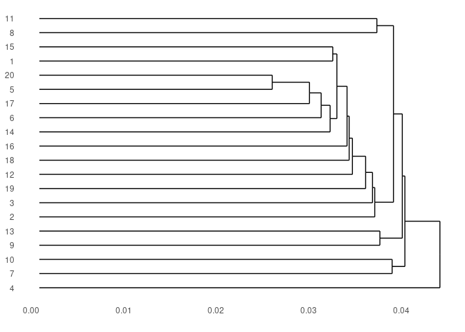
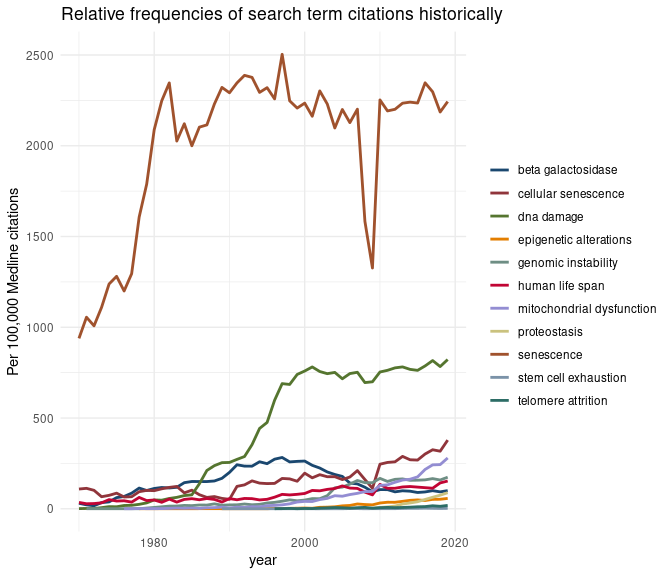

# PubmedMTK

***PubMed Mining Toolkit***

An R package for querying the PubMed database & parsing retrieved
records. Toolkit facilitates batch API requests, the creation of custom
corpora for NLP, and the quick exploration & visualization of topic
structure.

-   [Installation](#installation)
-   [Usage](#usage)
    -   [MeSH vocabulary](#mesh-vocabulary)
    -   [PubMed search](#pubmed-search)
    -   [Retrieve abstract data from
        PubMed](#retrieve-abstract-data-from-pubmed)
    -   [Extract MeSH classifications](#extract-mesh-classifications)
    -   [MeSH annotations-based topic
        model](#mesh-annotations-based-topic-model)
    -   [Two-dimensional analyses](#two-dimensional-analyses)

## Installation

``` r
devtools::install_github("jaytimm/PubmedMTK")
```

## Usage

### MeSH vocabulary

The package includes as a data frame the MeSH thesaurus &
hierarchically-organized vocabulary – comprised of 2021 versions of
`descriptor` & `trees` files made available via NLM-NIH. [A workflow for
re-creating the table from raw data
sets](https://github.com/jaytimm/PubmedMTK/blob/main/mds/build-MeSH-df.md).

### PubMed search

The `pmtk_search_pubmed()` function is meant for record-matching
searches typically performed using the [PubMed online
interface](https://pubmed.ncbi.nlm.nih.gov/). If multiple search terms
are specified, independent queries are performed per term. Output
includes record IDs per search term – which can subsequently be used to
fetch full records/abstracts.

Search terms are by default translated into NCBI syntax; for simplicity,
search is focused on *MeSH headings* (\[MH\]) and *titles & abstracts*
(\[TIAB\]). So: a search for `aging` is translated as
`aging[MH] OR aging[TIAB]`. The user can specify their own PubMed-ready
queries by setting the `translate_syntax` parameter to FALSE.

``` r
pmed_search <- c('proteostasis',
                 'telomere attrition',
                 'epigenetic alterations',
                 #'genomic instability',
                 'stem cell exhaustion')
```

``` r
search_results1 <- PubmedMTK::pmtk_search_pubmed(pmed_search = pmed_search)
```

    ## [1] "1 / 4 proteostasis[MH] OR proteostasis[TIAB]: 3686 records"
    ## [1] "2 / 4 telomere attrition[MH] OR telomere attrition[TIAB]: 863 records"
    ## [1] "3 / 4 epigenetic alterations[MH] OR epigenetic alterations[TIAB]: 5103 records"
    ## [1] "4 / 4 stem cell exhaustion[MH] OR stem cell exhaustion[TIAB]: 165 records"

### Retrieve abstract data from PubMed

#### Approach \#1

As a two-step process: (1) `pmtk_download_abs()` and (2)
`pmtk_loadr_abs()`. The approach utilized here is not the most elegant,
but it makes the most out of rate-limits by utilizing a combination of
local storage and “more + smaller” API batch queries (via the
`rentrez::entrez_fetch` package).

The `out_file` parameter specifies the file path for local batch file
storage; the `file_prefix` parameter specifies a character string used
to identify batches (along with a batch \#).

``` r
PubmedMTK::pmtk_download_abs(pmids = unique(search_results1$pmid),
                             out_file = paste0(working_dir, 'batches/'),
                             file_prefix = 'sen')
```

The `pmtk_loadr_abs()` function loads batch files as two data frames:
the first, a corpus object containing the record id and abstract, and
the second, a metadata object including record id and all other record
details, eg, article name, MeSH terms, Pub Date, etc.

``` r
sen_df <- PubmedMTK::pmtk_loadr_abs(in_file = batch_dir, 
                                    file_prefix = 'sen')
```

#### Approach \#2

> In one fell swoop – no local storage.

``` r
sen_df <- PubmedMTK::pmtk_get_records2(pmids = unique(search_results1$pmid), 
                                       cores = 6, 
                                       ncbi_key = key) 

sen_df <- data.table::rbindlist(sen_df)
```

### Extract MeSH classifications

Subject terms/headings in metadata table include `MeSH` terms, as well
as (some) `keywords` & `chem-names`. The `pmtk_gather_mesh` function
extracts & structures these attributes from metadata. The resulting
table amounts to a document-term matrix (DTM), in which each PubMed
abstract is represented as a vector of MeSH terms.

``` r
## or:: PubmedMTK::pmtk_gather_meshb
meshes <- PubmedMTK::pmtk_gather_mesh(meta_df = sen_df)
txts <- length(unique(meshes$pmid))

## get frequencies -- 
freqs <-  meshes[, list(doc_freq = length(unique(pmid))), 
                 by = list(descriptor_name)]
freqs$doc_prop <- freqs$doc_freq/ txts
freqs1 <- subset(freqs, doc_prop > 0.0001 & doc_prop < 0.02)

meshes1 <- subset(meshes, descriptor_name %in% freqs1$descriptor_name)
meshes1 <- subset(meshes1, nchar(descriptor_name) > 0)
```

Vector representations for a sample set of PubMed records is detailed
below:

``` r
set.seed(999)
meshes1 %>%
  filter(pmid %in% sample(unique(meshes1$pmid), 5)) %>%
  group_by(pmid) %>%
  summarize (mesh_reps = paste0(descriptor_name, collapse = ' | ')) %>%
  knitr::kable()
```

| pmid     | mesh_reps                                                                                                                                                                                                                                            |
|:---------|:-----------------------------------------------------------------------------------------------------------------------------------------------------------------------------------------------------------------------------------------------------|
| 12112316 | base sequence \| dna \| genes, fos \| keratinocytes \| masoprocol \| phosphorylation \| transcription factor ap-1 \| transcription, genetic \| ultraviolet rays \| transcription factor ap-1 \| masoprocol \| dna                                    |
| 23954725 | protein misfolding \| protein quality control \| ribosome \| translation \| cytosol \| protein biosynthesis \| proteostasis deficiencies \| quality control \| ribosomes \| ubiquitin-protein ligases \| ubiquitination \| ubiquitin-protein ligases |
| 28762764 | blood-air barrier \| lung injury \| respiratory distress syndrome                                                                                                                                                                                    |
| 29708900 | fertility \| fertilization in vitro \| infertility, female \| ovarian diseases \| ovarian reserve                                                                                                                                                    |
| 30693739 | anorexia nervosa \| chronic disease \| epigenome \| longitudinal studies \| remission induction                                                                                                                                                      |

### MeSH annotations-based topic model

We can use these MeSH-based abstract representations to explore the
conceptua structure of a particular collection of PubMed records via
topic modeling. Here we implement **Latent Dirichlet allocation**, which
is a topic modeling algorithm that models *each document* in corpus as a
composite of topics, and *each topic* as a composite of terms. Topic
composition can be interpreted as sets of MeSH terms that frequently
co-occur.

``` r
mesh_dtm <- tidytext::cast_sparse(data = meshes1,
                                  row = pmid,
                                  column = descriptor_name,
                                  value = count)

mesh_lda <- text2vec::LDA$new(n_topics = 20) ## This is the model
topic_model_fit <- mesh_lda$fit_transform(mesh_dtm, progressbar = F)
```

    ## INFO  [07:07:58.934] early stopping at 140 iteration 
    ## INFO  [07:08:00.009] early stopping at 20 iteration

The `mtk_summarize_lda` function summarizes and extracts topic
composition from the `text2vec::LDA` output. For each possible
topic-feature pair, the model computes the likelihood a given topic
generated a given feature. Output is filtered to the highest scoring
features per topic using the `topic_feats_n`.

``` r
tm_summary <- PubmedMTK::mtk_summarize_lda(
  lda = mesh_lda, topic_feats_n = 10)
```

#### Feature composition of first ten topics

| topic_id | topic_features                                                                                                                                                                                                                              |
|---------:|:--------------------------------------------------------------------------------------------------------------------------------------------------------------------------------------------------------------------------------------------|
|        1 | dna repair \| adaptor proteins, signal transducing \| carcinoma, squamous cell \| repressor proteins \| histone deacetylases \| carcinogenesis \| stem cells \| lung neoplasms \| apoptosis regulatory proteins \| cell cycle               |
|        2 | reactive oxygen species \| phosphorylation \| cell cycle proteins \| muscle, skeletal \| protein-serine-threonine kinases \| up-regulation \| energy metabolism \| proto-oncogene proteins c-akt \| gene deletion \| myocardium             |
|        3 | liver neoplasms \| carcinoma, hepatocellular \| microrna \| neoplastic stem cells \| histone modification \| epigenetic \| drug resistance, neoplasm \| tumor microenvironment \| biomarker \| epithelial-mesenchymal transition            |
|        4 | saccharomyces cerevisiae \| protein aggregates \| protein aggregation \| saccharomyces cerevisiae proteins \| mitochondrial proteins \| protein aggregation, pathological \| proteostasis deficiencies \| chaperone \| amyloid \| mitophagy |
|        5 | prostatic neoplasms \| neoplasm metastasis \| diet \| melanoma \| carcinogens \| immunotherapy \| environment \| skin neoplasms \| placenta \| embryonic development                                                                        |
|        6 | neoplasm proteins \| molecular targeted therapy \| telomere homeostasis \| telomeres \| telomere length \| genomic instability \| breast cancer \| senescence \| follow-up studies \| cystic fibrosis                                       |
|        7 | alzheimer disease \| mice, transgenic \| genomics \| nerve tissue proteins \| membrane proteins \| amyloid beta-peptides \| base sequence \| molecular sequence data \| alpha-synuclein \| parkinson disease                                |
|        8 | polymerase chain reaction \| dna, neoplasm \| neoplasm staging \| down-regulation \| brain neoplasms \| colonic neoplasms \| adenocarcinoma \| loss of heterozygosity \| immunohistochemistry \| glioblastoma                               |
|        9 | ubiquitination \| protein transport \| ubiquitin-protein ligases \| lysosomes \| hela cells \| cell survival \| tor serine-threonine kinases \| heat shock transcription factors \| cell nucleus \| protein biosynthesis                    |
|       10 | caenorhabditis elegans proteins \| neurodegeneration \| rna interference \| er stress \| amyotrophic lateral sclerosis \| peptides \| drosophila melanogaster \| metabolism \| alzheimer’s disease \| rna, small interfering                |

### Two-dimensional analyses

``` r
tmat <- tidytext::cast_sparse(data = tm_summary$topic_word_dist,
                              row = topic_id,
                              column = feature,
                              value = beta)

## build 2d data structures --
two_ds <- PubmedMTK::pmtk_2d(mat = tmat)
```

#### Hierarchical clustering

``` r
#two_ds$hc$labels <- tm_summary$topic_summary$topic_features
two_ds$hc %>% ggdendro::ggdendrogram(rotate=TRUE)
```



#### Principal component analysis (PCA)

``` r
two_ds$pca %>%
  ggplot(aes(x = X1,
             y = X2,
             label = topic_id)) +
  ggplot2::geom_point(size = 10, 
                      color = '#a5c8e1',
                      alpha = 0.5) +
  geom_text(size = 3) +
  ggtitle('Topics in 2d PCA space')
```


