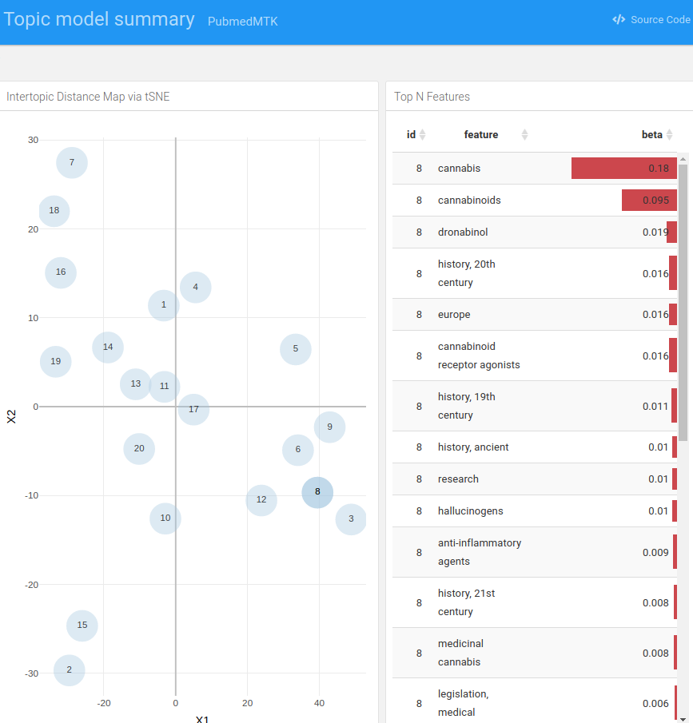

# PubmedMTK

`PubMed Mining Toolkit` \| An R package for querying the PubMed database
& parsing retrieved records. Toolkit facilitates batch API requests, the
creation of custom corpora for NLP, and the quick exploration &
visualization of topic structure.

-   [Installation](#installation)
-   [Usage](#usage)
    -   [PubMed search](#pubmed-search)
    -   [Retrieve and parse abstract
        data](#retrieve-and-parse-abstract-data)
    -   [KWIC search](#kwic-search)
    -   [Extract MeSH classifications](#extract-mesh-classifications)
    -   [MeSH annotations-based topic
        model](#mesh-annotations-based-topic-model)
-   [Interactive HTML topic summary](#interactive-html-topic-summary)
-   [Tables](#tables)
    -   [MeSH vocabulary](#mesh-vocabulary)
    -   [PMC MeSH annotation
        frequencies](#pmc-mesh-annotation-frequencies)
-   [Contributing](#contributing)

## Installation

``` r
devtools::install_github("jaytimm/PubmedMTK")
```

## Usage

### PubMed search

The `pmtk_search_pubmed()` function is meant for record-matching
searches typically performed using the [PubMed online
interface](https://pubmed.ncbi.nlm.nih.gov/). The `search_term`
parameter specifies the query term; the `fields` parameter can be used
to specify which fields to query.

``` r
s0 <- PubmedMTK::pmtk_search_pubmed(search_term = 'medical marijuana', 
                                    fields = c('TIAB','MH'))
```

    ## [1] "medical marijuana[TIAB] OR medical marijuana[MH]: 2173 records"

``` r
head(s0)
```

    ##          search_term     pmid
    ## 1: medical marijuana 34234903
    ## 2: medical marijuana 34232573
    ## 3: medical marijuana 34225825
    ## 4: medical marijuana 34179729
    ## 5: medical marijuana 34176017
    ## 6: medical marijuana 34159050

### Retrieve and parse abstract data

For quicker abstract retrieval, be sure to get an [API
key](https://support.nlm.nih.gov/knowledgebase/article/KA-03521/en-us).

``` r
sen_df <- PubmedMTK::pmtk_get_records2(pmids = s0$pmid, 
                                       cores = 6, 
                                       ncbi_key = key) 
```

> Sample record from output:

``` r
sen_df <- data.table::rbindlist(sen_df)

n <- 10
list(pmid = sen_df$pmid[n],
     year = sen_df$year[n],
     articletitle = strwrap(sen_df$articletitle[n], width = 60),
     meshHeadings = strwrap(sen_df$meshHeadings[n], width = 60),
     text = strwrap(sen_df$abstract[n], width = 60)[1:10])
```

    ## $pmid
    ## [1] "34095048"
    ## 
    ## $year
    ## [1] "2021"
    ## 
    ## $articletitle
    ## [1] "Evaluation of Patient Reported Safety and Efficacy of" 
    ## [2] "Cannabis From a Survey of Medical Cannabis Patients in"
    ## [3] "Canada."                                               
    ## 
    ## $meshHeadings
    ## [1] "Canada|Cannabis|Humans|Male|Medical Marijuana|Patient"
    ## [2] "Reported Outcome Measures|Quality of Life|Surveys and"
    ## [3] "Questionnaires"                                       
    ## 
    ## $text
    ##  [1] "With the medical use of cannabis permitted in Canada since" 
    ##  [2] "2001, patients seek to use this botanical drug to treat a"  
    ##  [3] "range of medical conditions. However, many healthcare"      
    ##  [4] "practitioners express the need for further scientific"      
    ##  [5] "evidence around the use of medical cannabis. This"          
    ##  [6] "real-world evidence study aimed to address the paucity of"  
    ##  [7] "scientific data by surveying newly registered medical"      
    ##  [8] "cannabis patients, before beginning medical cannabis"       
    ##  [9] "treatment, and at one follow up 6 weeks after beginning"    
    ## [10] "medical cannabis treatment. The goal was to collect data on"

### KWIC search

The `pmtk_locate_term()` function allows for quick keyword-in-context
(KWIC) search. A simple wrapper of the `corpus::text_locate` function.

``` r
toks <-  corpus::text_tokens(sen_df$abstract)

egs <- PubmedMTK::pmtk_locate_term(text = toks,
                                   doc_id = sen_df$pmid,
                                   term = c('medical marijuana laws'),
                                   stem = F,
                                   window = 10)

egs$kwic <- paste0('... ', egs$lhs, ' `', egs$instance, '` ', egs$rhs, ' ...')
knitr::kable(egs[1:8, c(1,5)])
```

| doc_id   | kwic                                                                                                                                                                       |
|:---------|:---------------------------------------------------------------------------------------------------------------------------------------------------------------------------|
| 34128629 | … , and driving . physicians can recommend use of marijuana under `medical marijuana laws` but cannot prescribe it , as it is classified as a …                            |
| 33750275 | … moving to reverse marijuana prohibition , most frequently through legalization of `medical marijuana laws` ( mmls ) , and there is concern that marijuana legalization … |
| 33730400 | … recreational marijuana laws ( rml ) , followed by states with `medical marijuana laws` ( mml ) and without legal cannabis use , respectively . …                         |
| 33624387 | … differences-in-differences ( dd ) approach and found that the implementation of `medical marijuana laws` ( mmls ) and recreational marijuana laws ( rmls ) reduced …     |
| 33143941 | … . cannabis legalization was determined by the presence or absence of `medical marijuana laws` ( mml ) and recreational marijuana laws ( rml ) in …                       |
| 33069561 | … , a limited but growing body of literature has found state `medical marijuana laws` ( mmls ) to be associated with lower levels of opioid …                              |
| 32799573 | … management , much research has since focused on the potential for `medical marijuana laws` ( mmls ) to curb the opioid epidemic . nonetheless , …                        |
| 32736294 | … cannabis use disorder are more prevalent in u.s . states with `medical marijuana laws` ( mmls ) , as well as among individuals with elevated …                           |

### Extract MeSH classifications

Subject terms/headings in metadata table include `MeSH` terms, as well
as (some) `keywords` & `chem-names`. The `pmtk_gather_mesh` function
extracts & structures these attributes from metadata.

``` r
m0 <- PubmedMTK::pmtk_gather_mesh(sen_df)
```

### MeSH annotations-based topic model

We can use these MeSH-based abstract representations to explore the
conceptual structure of a particular collection of PubMed records via
topic modeling. Here we implement **Latent Dirichlet allocation**, which
is a topic modeling algorithm that models *each document* in corpus as a
composite of topics, and *each topic* as a composite of terms.

``` r
as.text <- m0[, list(text = paste(term, collapse = " ")), by = pmid]
iter <- text2vec::itoken(as.text$text, ids = as.text$pmid)  
vocab <- text2vec::create_vocabulary(iter)

vocab0 <- text2vec::prune_vocabulary(
  vocab, 
  # doc_proportion_min = 0.0001,
  doc_proportion_max = 0.55,
  doc_count_min = 3) 

vectorizer <- text2vec::vocab_vectorizer(vocab0)
dtm <- text2vec::create_dtm(iter, vectorizer)
```

The `pmtk_summarize_lda` function summarizes and extracts topic
composition from the `text2vec::LDA` output.

``` r
lda <- text2vec::LDA$new(n_topics = 20) 
fit <- lda$fit_transform(dtm, progressbar = F)
```

    ## INFO  [09:08:58.558] early stopping at 100 iteration 
    ## INFO  [09:08:58.634] early stopping at 30 iteration

``` r
tm_summary <- PubmedMTK::pmtk_summarize_lda(
  lda = lda, topic_feats_n = 10)
```

#### Feature composition of first ten topics

| topic_id | topic_features                                                                                                                                                                                                                                  |
|---------:|:------------------------------------------------------------------------------------------------------------------------------------------------------------------------------------------------------------------------------------------------|
|        1 | cannabis \| canada \| public_health \| tetrahydrocannabinol \| health_services_accessibility \| health_knowledge,\_attitudes,\_practice \| dronabinol \| patient_education_as_topic \| legalization \| cannabinoids                             |
|        2 | male \| female \| marijuana \| marijuana_use \| pregnancy \| health_surveys \| adolescents \| substance_use \| substance_withdrawal_syndrome \| breast_feeding                                                                                  |
|        3 | legislation,\_drug \| united_states \| politics \| california \| public_policy \| cannabis \| commerce \| policy \| seizure \| public_opinion                                                                                                   |
|        4 | nausea \| vomiting \| cannabidiol \| drug_and_narcotic_control \| chronic_pain \| cannabis \| attitude_of_health_personnel \| united_states_food_and_drug_administration \| antineoplastic_agents \| dronabinol                                 |
|        5 | female \| male \| prevalence \| substance-related_disorders \| cross-sectional_studies \| young_adult \| risk_factors \| adult \| marijuana \| alcohol_drinking                                                                                 |
|        6 | chronic_pain \| cannabis \| analgesics,\_opioid \| opioid-related_disorders \| hallucinogens \| hiv_infections \| longitudinal_studies \| cannabinoid \| new_zealand \| health_policy                                                           |
|        7 | phytotherapy \| drug_and_narcotic_control \| plant_preparations \| physicians \| pain_management \| jurisprudence \| civil_rights \| knowledge \| analgesics \| history,\_19th_century                                                          |
|        8 | cannabis \| phytotherapy \| united_states \| cbd \| thc \| california \| crime \| san_francisco \| commerce \| canada                                                                                                                           |
|        9 | pain \| marijuana \| neoplasms \| multiple_sclerosis \| plant_extracts \| palliative_care \| dronabinol \| analgesics \| muscle_spasticity \| nabiximols                                                                                        |
|       10 | cannabis \| state_government \| marijuana_smoking \| health_policy \| federal_government \| phytotherapy \| government_regulation \| united_states_food_and_drug_administration \| physician-patient_relations \| health_care_and_public_health |

## Interactive HTML topic summary

``` r
tmat <- tidytext::cast_sparse(data = tm_summary$topic_word_dist,
                              row = topic_id,
                              column = feature,
                              value = beta)

set.seed(99)
tsne <- Rtsne::Rtsne(X = as.matrix(tmat), 
                     check_duplicates = T,
                     perplexity = 5)

tsne0 <- data.frame(topic_id = as.integer(rownames(tmat)), tsne$Y)
```

``` r
PubmedMTK::pmtk_build_interactive(pmtk_lda = tm_summary,
                                  pmtk_2d = tsne0,
                                  out_dir = '/home/jtimm/Desktop/',
                                  file_name = 'party.html')
```



## Tables

### MeSH vocabulary

The package includes as a data frame the MeSH thesaurus &
hierarchically-organized vocabulary – comprised of 2021 versions of
`descriptor` & `trees` files made available via NLM-NIH. [A
workflow](https://github.com/jaytimm/PubmedMTK/blob/main/mds/build-MeSH-df.md)
for re-creating the table from raw data sets.

``` r
PubmedMTK::pmtk_tbl_mesh[1:5, c(1:3, 5:6)]
```

    ##    DescriptorUI DescriptorName          TermName                cats
    ## 1:      D000001     calcimycin        calcimycin Chemicals and Drugs
    ## 2:      D000001     calcimycin           a-23187 Chemicals and Drugs
    ## 3:      D000001     calcimycin           a 23187 Chemicals and Drugs
    ## 4:      D000001     calcimycin            a23187 Chemicals and Drugs
    ## 5:      D000001     calcimycin antibiotic a23187 Chemicals and Drugs
    ##                     mesh1
    ## 1: Heterocyclic Compounds
    ## 2: Heterocyclic Compounds
    ## 3: Heterocyclic Compounds
    ## 4: Heterocyclic Compounds
    ## 5: Heterocyclic Compounds

### PMC MeSH annotation frequencies

MeSH annotation frequencies for the Open Access Common Use portion of
PMC. Frequencies based on roughly 1.8 million PubMed records. Details
[here](https://github.com/jaytimm/PubmedMTK/blob/main/mds/pmc-reference.md).

``` r
PubmedMTK::pmtk_tbl_pmc_ref
```

    ##                  type                   DescriptorName doc_count     doc_prop
    ##       1: meshHeadings                       algorithms     35621 1.963793e-02
    ##       2: meshHeadings           crystallography,_x-ray      6384 3.519512e-03
    ##       3: meshHeadings data_interpretation,_statistical      3216 1.772987e-03
    ##       4: meshHeadings                 fourier_analysis       472 2.602145e-04
    ##       5: meshHeadings              molecular_structure      8696 4.794122e-03
    ##      ---                                                                     
    ## 1304693: meshHeadings         tricuspid_valve_stenosis         1 5.513020e-07
    ## 1304694: meshHeadings                    ethylestrenol         1 5.513020e-07
    ## 1304695:    chemNames         monoethylglycinexylidide         1 5.513020e-07
    ## 1304696:    chemNames                           savlon         1 5.513020e-07
    ## 1304697:    chemNames            7-propyl_spirolactone         1 5.513020e-07

## Contributing

The project maintainer welcomes contributions in the form of feature
requests, bug reports, comments, unit tests, vignettes, or other code.
If you’d like to contribute, either:

-   fork the repository and submit a [pull
    request](https://github.com/jaytimm/PubmedMTK/pulls); or

-   file an [issue](https://github.com/jaytimm/PubmedMTK/issues).

Thanks!
