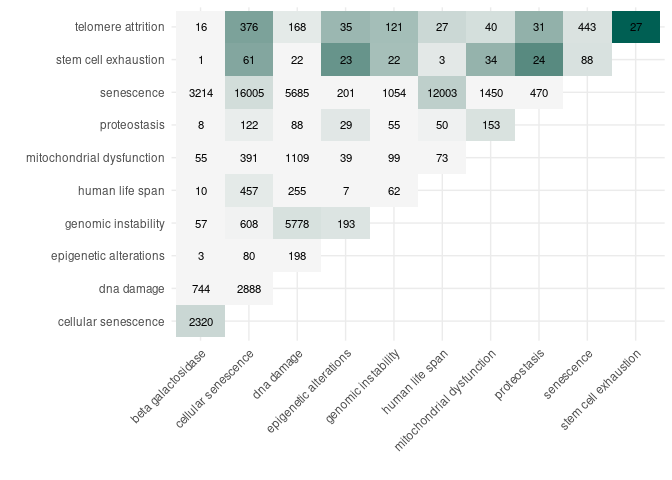
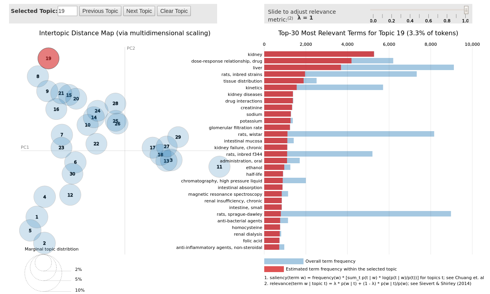

# PubmedMTK

***PubMed Mining Toolkit***

An R package for accessing, manipulating, and visualizing data made
available on PubMed using R, including (1) PubMed query tools, (2) query
exploration tools, and (3) abstract-level data acquisition tools.

Included here is a set of example applications, including:

-   Automated, independent searches for multiple (& complex) search
    queries;
-   More in-depth exploration of PubMed search results; namely, the
    investigation of high-level co-occurrence associations among query
    terms;
-   Extraction of abstract-level metadata for (1) comparing citation
    trends historically and (2) investigating annotation-based topic
    structure within a set abstracts; and
-   Creation of custom text corpora based on PubMed abstracts.

------------------------------------------------------------------------

-   [Installation](#installation)
-   [Usage](#usage)
    -   [MeSH vocabulary](#mesh-vocabulary)
    -   [PubMed search -
        `pmtk_search_pubmed()`](#pubmed-search---%60pmtk_search_pubmed()%60)
    -   [Advanced counting -
        `pmtk_crosstab_query()`](#advanced-counting---%60pmtk_crosstab_query()%60)
    -   [Fetch abstract data from
        PubMed](#fetch-abstract-data-from-pubmed)
    -   [Citation trends historically](#citation-trends-historically)
    -   [Extract MeSH classifications -
        `pmtk_gather_mesh()`](#extract-mesh-classifications---%60pmtk_gather_mesh()%60)
    -   [MeSH-based topic model](#mesh-based-topic-model)
    -   [Google image analysis](#google-image-analysis)

------------------------------------------------------------------------

## Installation

``` r
devtools::install_github("jaytimm/PubmedMTK")
```

## Usage

``` r
working_dir <- '/home/jtimm/jt_work/GitHub/PubmedMTK/data-raw/'

if (!require("pacman")) install.packages("pacman")
pacman::p_load(data.table, # quanteda, 
               rentrez, 
               XML, xml2, httr,
               reshape2, #text2vec,  
               tokenizers, 
               tm,
               tidytext,
               Matrix.utils,
               janitor,
               ggplot2, knitr,
               magrittr, dplyr, tidyr)
```

### MeSH vocabulary

For starters, the package includes as a data frame the MeSH thesaurus &
hierarchically-organized vocabulary – comprised of 2021 versions of
`descriptor` & `trees` files made available via NLM-NIH. [A workflow for
re-creating the table from raw data
sets](https://github.com/jaytimm/PubmedMTK/blob/main/build-MeSH-df.md).

``` r
knitr::kable(head(PubmedMTK::pmtk_tbl_mesh))
```

| DescriptorUI | DescriptorName | TermName           | code | cats                | mesh1                  | mesh2                              | tree_location       | tree1 | tree2   |
|:-------------|:---------------|:-------------------|:-----|:--------------------|:-----------------------|:-----------------------------------|:--------------------|:------|:--------|
| D000001      | calcimycin     | calcimycin         | D    | Chemicals and Drugs | Heterocyclic Compounds | Heterocyclic Compounds, Fused-Ring | D03.633.100.221.173 | D03   | D03.633 |
| D000001      | calcimycin     | a-23187            | D    | Chemicals and Drugs | Heterocyclic Compounds | Heterocyclic Compounds, Fused-Ring | D03.633.100.221.173 | D03   | D03.633 |
| D000001      | calcimycin     | a 23187            | D    | Chemicals and Drugs | Heterocyclic Compounds | Heterocyclic Compounds, Fused-Ring | D03.633.100.221.173 | D03   | D03.633 |
| D000001      | calcimycin     | a23187             | D    | Chemicals and Drugs | Heterocyclic Compounds | Heterocyclic Compounds, Fused-Ring | D03.633.100.221.173 | D03   | D03.633 |
| D000001      | calcimycin     | antibiotic a23187  | D    | Chemicals and Drugs | Heterocyclic Compounds | Heterocyclic Compounds, Fused-Ring | D03.633.100.221.173 | D03   | D03.633 |
| D000001      | calcimycin     | a23187, antibiotic | D    | Chemicals and Drugs | Heterocyclic Compounds | Heterocyclic Compounds, Fused-Ring | D03.633.100.221.173 | D03   | D03.633 |

### PubMed search - `pmtk_search_pubmed()`

The `pmtk_search_pubmed()` function is meant for record-matching
searches typically performed using the [PubMed online
interface](https://pubmed.ncbi.nlm.nih.gov/). If multiple search terms
are specified, independent queries are performed per term. Output
includes record IDs per search term – which can subsequently be used to
fetch full records/abstracts.

Search terms are by default translated into NCBI syntax; for simplicity,
search is focused on *MeSH headings* (\[MH\]) and *titles & abstracts*
(\[TIAB\]). So: a search for `aging` is translated as
`aging[MH] OR aging[TIAB]`. The user can specify their own PubMed-ready
queries by setting the `translate_syntax` parameter to FALSE.

``` r
pmed_search <- c('human life span',
                 'senescence', 
                 'proteostasis',
                 'dna damage', 
                 'beta galactosidase', 
                 'genomic instability',
                 'telomere attrition',
                 'epigenetic alterations',
                 'mitochondrial dysfunction',
                 'cellular senescence',
                 'stem cell exhaustion')
```

``` r
search_results1 <- PubmedMTK::pmtk_search_pubmed(pmed_search = pmed_search)
```

#### Summary of record counts returned by PubMed query

``` r
# ## Total citations per search term are summarized below:
search_results1 %>%
  group_by(search) %>%
  summarise(n = n()) %>%
  arrange(desc(n)) %>%
  #janitor::adorn_totals() %>%
  knitr::kable()
```

| search                    |      n |
|:--------------------------|-------:|
| senescence                | 278659 |
| dna damage                | 134703 |
| beta galactosidase        |  33254 |
| cellular senescence       |  25707 |
| mitochondrial dysfunction |  22063 |
| genomic instability       |  21671 |
| human life span           |  12145 |
| epigenetic alterations    |   5049 |
| proteostasis              |   3625 |
| telomere attrition        |    853 |
| stem cell exhaustion      |    162 |

#### Unique records

``` r
length(unique(search_results1$pmid))
```

    ## [1] 489299

### Advanced counting - `pmtk_crosstab_query()`

Based simply on the table of record IDs returned from
`pmtk_search_pubmed()`, we can quickly investigate co-occurrence among
our set of search terms. Here, `term1` and `term2` are said to co-occur
in *abstract X* if independent PubMed queries for `term1` and `term2`
both return *abstract X*. Ideal for quick exploration.

The table below details co-occurrence patterns among `senescence`-based
search pairs. Columns `n1` and `n2` specify citation counts for `term1`
and `term2`, respectively; column `n1n2` specifies the count of
citations returned by both `term1` & `term2`, ie, the intersect between
the two sets of record IDs. The strength of association between `term1`
& `term2`, then, is approximated via pointwise mutual information
(`pmi`), which is computed as the log difference of actual vs. expected
co-occurrence probabilities.

``` r
search_tab <- PubmedMTK::pmtk_crosstab_query(search_results1) %>%
  mutate(pmi = round(log( (n1n2/1e6) / ( (n1/1e6) * (n2/1e6) )), 3))

search_tab %>% filter(term1 == 'senescence') %>% knitr::kable()
```

| term1      | term2                     |     n1 |     n2 |  n1n2 |    pmi |
|:-----------|:--------------------------|-------:|-------:|------:|-------:|
| senescence | beta galactosidase        | 278659 |  33254 |  3214 | -1.059 |
| senescence | cellular senescence       | 278659 |  25707 | 16005 |  0.804 |
| senescence | dna damage                | 278659 | 134703 |  5685 | -1.887 |
| senescence | epigenetic alterations    | 278659 |   5049 |   201 | -1.946 |
| senescence | genomic instability       | 278659 |  21671 |  1054 | -1.746 |
| senescence | human life span           | 278659 |  12145 | 12003 |  1.266 |
| senescence | mitochondrial dysfunction | 278659 |  22063 |  1450 | -1.445 |
| senescence | proteostasis              | 278659 |   3625 |   470 | -0.765 |
| senescence | stem cell exhaustion      | 278659 |    162 |    88 |  0.668 |
| senescence | telomere attrition        | 278659 |    853 |   443 |  0.623 |

**The plot below** details PMI-based associative strengths among search
terms (as \~heatmap). Labels specify co-occurrence in terms of citation
counts; color denotes PMI value.

``` r
search_tab %>%
  mutate(pmi = ifelse(pmi < 0, 0, pmi),
         term2 = as.character(term2)) %>%
  rowwise() %>%
  
  mutate(ords = paste(sort(c(term1, term2)), collapse = '_')) %>%
  group_by(ords) %>% slice(1) %>% ungroup() %>%
  
  #arrange(term1, term2) %>%
  ggplot(aes(x = term1, y = term2, fill = pmi)) + 
  geom_tile() + 
  geom_text(aes(fill = pmi, label = n1n2), size = 3) + 
  scale_fill_gradient2(low = scales::muted("#d8b365"), 
                       mid = "#f5f5f5", 
                       high = scales::muted('#5ab4ac'),
                       midpoint = 0) +
  theme_minimal() + xlab('') + ylab('') +
  theme(legend.position = 'none',
        axis.text.x = element_text(angle = 45, hjust = 1))
```



### Fetch abstract data from PubMed

As a two-step process: (1) `pmtk_download_abs()` and (2)
`pmtk_loadr_abs()`. The approach utilized here is not the most elegant,
but it makes the most out of rate-limits by utilizing a combination of
local storage and “more + smaller” API batch queries (via the
`rentrez::entrez_fetch` package). Each “batch” contains n = 199 records;
batch files are converted from [XML to a data
frame](https://github.com/christopherBelter/pubmedXML) in RDS format and
stored locally in a user-specified file path.

#### Download batch data - `pmtk_download_abs()`

The `out_file` parameter specifies the file path for local batch file
storage; the `file_prefix` parameter specifies a character string used
to identify batches (along with a batch \#).

``` r
PubmedMTK::pmtk_download_abs(pmids = unique(search_results1$pmid),
                             out_file = paste0(working_dir, 'batches/'),
                             file_prefix = 'sen')
```

#### Load batch data - `pmtk_loadr_abs()`

The `pmtk_loadr_abs()` function loads batch files as two data frames:
the first, a corpus object containing the record id and abstract, and
the second, a metadata object including record id and all other record
details, eg, article name, MeSH terms, Pub Date, etc.

``` r
# batch_dir <- dr
batch_dir <- paste0(working_dir, 'batches/')
sen_df <- PubmedMTK::pmtk_loadr_abs(in_file = batch_dir, 
                                    file_prefix = 'sen')
```

#### CORPUS details

Some descriptives for the resulting corpus of abstracts are detailed
below:

``` r
sen_df$tif %>%
  mutate(includes_abstract = ifelse(is.na(text), 'N', 'Y')) %>%
  count(includes_abstract) %>%
  mutate(tokens = ifelse(includes_abstract == 'Y',
                         n* 210, NA)) %>%
  knitr::kable()
```

| includes_abstract |      n |    tokens |
|:------------------|-------:|----------:|
| N                 | 127898 |        NA |
| Y                 | 820756 | 172358760 |

``` r
sen_df$tif$text[1191] %>% strwrap()
```

    ##  [1] "It is known that distraction reduces the benefits of collision"         
    ##  [2] "avoidance systems by slowing a driver's response. The current study"    
    ##  [3] "examined the impact of a drivers' use of an in-vehicle intersection"    
    ##  [4] "crossing assist system under demanding cognitive load conditions. Forty"
    ##  [5] "eight drivers crossed a busy rural intersection in a simulated"         
    ##  [6] "environment while completing four blocks of trials, in half of which"   
    ##  [7] "they used the assist system and engaged in a working memory task."      
    ##  [8] "Participants were dichotomized into older and younger age groups. The"  
    ##  [9] "results showed a tendency towards conservative driving in a single-task"
    ## [10] "condition when only using the assist system. A similar shift in driving"
    ## [11] "style was observed when drivers crossed the intersection while engaged" 
    ## [12] "in a secondary task. Using the in-vehicle intersection crossing assist" 
    ## [13] "system under cognitively demanding conditions did not result in adverse"
    ## [14] "consequences-the impact of distraction was different compared to a"     
    ## [15] "typical collision avoidance system. Older drivers showed some evidence" 
    ## [16] "of more conservative intersection crossing, however they also appeared" 
    ## [17] "to rely more on the in-vehicle assist system when presented with an"    
    ## [18] "extraneous additional task."

#### RECORD details

Each PubMed record returned from batch download includes some or all of
the following attributes:

``` r
sen_df$meta %>%
  filter(complete.cases(.)) %>% 
  slice(1) %>%
  data.table::transpose(keep.names = "var") %>%
  mutate(V1 = gsub('\\|', ' \\| ', V1)) %>%
  knitr::kable()
```

| var           | V1                                                                                                                                                                                                                                                                                                                                                        |
|:--------------|:----------------------------------------------------------------------------------------------------------------------------------------------------------------------------------------------------------------------------------------------------------------------------------------------------------------------------------------------------------|
| pmid          | 31748285                                                                                                                                                                                                                                                                                                                                                  |
| doi           | 10.1136/bmjopen-2018-027984                                                                                                                                                                                                                                                                                                                               |
| authors       | Ali D \| Callan N \| Ennis S \| Powell R \| McGuire S \| McGregor G \| Weickert MO \| Miller MA \| Cappuccio FP \| Banerjee P                                                                                                                                                                                                                             |
| year          | 2019                                                                                                                                                                                                                                                                                                                                                      |
| articletitle  | Heart failure with preserved ejection fraction (HFpEF) pathophysiology study (IDENTIFY-HF): does increased arterial stiffness associate with HFpEF, in addition to ageing and vascular effects of comorbidities? Rationale and design.                                                                                                                    |
| journal       | BMJ Open                                                                                                                                                                                                                                                                                                                                                  |
| volume        | 9                                                                                                                                                                                                                                                                                                                                                         |
| issue         | 11                                                                                                                                                                                                                                                                                                                                                        |
| pages         | e027984                                                                                                                                                                                                                                                                                                                                                   |
| meshHeadings  | Aged \| Aged, 80 and over \| Aging \| Biomarkers \| Comorbidity \| Diabetes Mellitus \| Echocardiography \| Exercise Tolerance \| Female \| Heart Failure \| Heart Ventricles \| Humans \| Hypertension \| Male \| Observational Studies as Topic \| Prospective Studies \| Pulse Wave Analysis \| Research Design \| Stroke Volume \| Vascular Stiffness |
| chemNames     | Biomarkers                                                                                                                                                                                                                                                                                                                                                |
| nctID         | NCT03186833                                                                                                                                                                                                                                                                                                                                               |
| ptype         | Journal Article                                                                                                                                                                                                                                                                                                                                           |
| keywords      | arterial stiffness \| comorbidities \| heart failure with preserved ejection fraction \| pathophysiology                                                                                                                                                                                                                                                  |
| revision_date | 18565                                                                                                                                                                                                                                                                                                                                                     |

### Citation trends historically

Based on (1) search results from the `pubmed_get_ids` function, and (2)
the metadata returned from `pmtk_loadr_abs()`, we can investigate &
compare historical citation frequencies for our set of search terms. The
package ships with a table summarizing [total Medline citation counts by
year](https://www.nlm.nih.gov/bsd/medline_cit_counts_yr_pub.html), which
facilitates straightforward computation of relative citation frequency
for search term(s) by year (here, per 100K citations).

``` r
## in theory, this could be used for other things -- 
tr <- subset(sen_df$meta, !grepl('[a-z]', year))
tr$year <- as.Date(paste(tr$year, '01', '01', sep = '-'))
tr1 <- tr[search_results1, on = 'pmid']

## 
meds <- data.table::data.table(PubmedMTK::pmtk_tbl_citations)
tr2 <-  tr1[, list(n = .N), by = list(search, year)]
tr3 <- subset(tr2, year > as.Date('1969', format = '%Y') &
                year < as.Date('2019', format = '%Y') )
tr4 <- meds[tr3, on = 'year']
tr4$per_100k = round(tr4$n / tr4$total * 100000, 3)
```

#### Citation frequencies (per 100K total citations) for `senescence`related search terms from 1970 to 2018.

``` r
## Via ggplot --
tr4 %>%
  ggplot() +
  geom_line(aes(x = year,
                #y = n,  ## RAW Citation counts
                y = per_100k, ## Relative citation counts -- 
                group = search,
                color = search),
            size = 1
            ) +
  theme_minimal() +
  ggthemes::scale_color_stata() +
  theme(legend.position = 'right',
        legend.title = element_blank())  +
  ylab('Per 100,000 Medline citations') +
  ggtitle('Relative frequencies of search term citations historically')
```


### Extract MeSH classifications - `pmtk_gather_mesh()`

Subject terms/headings in metadata table include `MeSH` terms, as well
as (some) `keywords` & `chem-names`. The `pmtk_gather_mesh` function
extracts these attributes from metadata, and outputs them in structured
format. The resulting table amounts to a document-term matrix (DTM), in
which each PubMed abstract is represented as a vector of MeSH terms.

``` r
## this takes too long --based
meshes <- PubmedMTK::pmtk_gather_mesh(meta_df = sen_df$meta)
txts <- length(unique(meshes$pmid))


## get frequencies -- 
freqs <-  meshes[, list(doc_freq = length(unique(pmid))), 
                 by = list(descriptor_name)]
freqs$doc_prop <- freqs$doc_freq/ txts
freqs1 <- subset(freqs, doc_prop > 0.0001 & doc_prop < 0.02)

meshes1 <- subset(meshes, descriptor_name %in% freqs1$descriptor_name)
meshes1 <- subset(meshes1, nchar(descriptor_name) > 0)
```

Vector representations for a sample set of PubMed records is detailed
below:

``` r
set.seed(999)
meshes1 %>%
  filter(pmid %in% sample(unique(meshes1$pmid), 5)) %>%
  group_by(pmid) %>%
  summarize (mesh_reps = paste0(descriptor_name, collapse = ' | ')) %>%
  knitr::kable()
```

| pmid     | mesh_reps                                                                                                                                                                                                                                                                                                                                                                                                                                                                                            |
|:---------|:-----------------------------------------------------------------------------------------------------------------------------------------------------------------------------------------------------------------------------------------------------------------------------------------------------------------------------------------------------------------------------------------------------------------------------------------------------------------------------------------------------|
| 14081572 | adolescence \| histology \| infant \| skin \| histology \| infant \| skin                                                                                                                                                                                                                                                                                                                                                                                                                            |
| 16012945 | acetylation \| actin cytoskeleton \| adenoma \| amino acid sequence \| cell line, transformed \| colorectal neoplasms \| dna methylation \| epigenesis, genetic \| gene expression regulation, neoplastic \| gene silencing \| genes, tumor suppressor \| genes, ras \| histones \| kidney \| proteins \| tumor suppressor proteins \| histones \| proteins \| tumor suppressor proteins                                                                                                             |
| 1907469  | parkinson disease \| psychomotor performance \| serine \| serine                                                                                                                                                                                                                                                                                                                                                                                                                                     |
| 30484227 | adult stem cells \| biological evolution \| cell differentiation \| induced pluripotent stem cells \| pluripotent stem cells                                                                                                                                                                                                                                                                                                                                                                         |
| 30810280 | lifespan \| metabolism \| proteostasis \| drosophila \| drosophila proteins \| gene ontology \| glucose \| glucosephosphate dehydrogenase \| glycolysis \| jnk mitogen-activated protein kinases \| lysine \| mass spectrometry \| pentose phosphate pathway \| phosphoprotein phosphatases \| proteome \| proteostasis \| rna-seq \| drosophila proteins \| proteome \| glucosephosphate dehydrogenase \| jnk mitogen-activated protein kinases \| phosphoprotein phosphatases \| glucose \| lysine |

### MeSH-based topic model

We then use these MeSH-based abstract representations to explore the
conceptual/semantic structure of abstracts included in the `senescence`
corpus via topic modeling. Here we implement **Latent Dirichlet
allocation**, which is a topic modeling algorithm that models *each
document* in corpus as a composite of topics, and *each topic* as a
composite of terms. Topic composition can be interpreted as sets of MeSH
terms that frequently co-occur.

``` r
mesh_dtm <- tidytext::cast_sparse(data = meshes1,
                                  row = pmid,
                                  column = descriptor_name,
                                  value = count)

mesh_lda <- text2vec::LDA$new(n_topics = 30) ## This is the model
topic_model_fit <- mesh_lda$fit_transform(mesh_dtm, progressbar = F)
```

The `mtk_summarize_lda` function summarizes and extracts topic
composition from the `text2vec::LDA` output. For each possible
topic-feature pair, the model computes the likelihood a given topic
generated a given feature. Output is filtered to the highest scoring
features per topic using the `topic_feats_n`.

``` r
tm_summary <- PubmedMTK::mtk_summarize_lda(
  lda = mesh_lda, topic_feats_n = 15)
```

#### Feature composition of first ten topics

| topic_id | topic_features                                                                                                                                                                                                                                                                                                                                                                            |
|---------:|:------------------------------------------------------------------------------------------------------------------------------------------------------------------------------------------------------------------------------------------------------------------------------------------------------------------------------------------------------------------------------------------|
|        1 | transfection \| blotting, western \| genetic vectors \| reverse transcriptase polymerase chain reaction \| genes, reporter \| mice, transgenic \| microscopy, fluorescence \| fluorescent antibody technique \| flow cytometry \| genetic therapy \| gene transfer techniques \| retina \| adenoviridae \| promoter regions, genetic \| green fluorescent proteins                        |
|        2 | hypertension \| inflammation \| cardiovascular diseases \| smoking \| treatment outcome \| blood pressure \| lung \| retrospective studies \| disease progression \| arteriosclerosis \| chronic disease \| hiv infections \| prognosis \| immunity, innate \| risk                                                                                                                       |
|        3 | enzyme activation \| caspase 3 \| caspases \| enzyme inhibitors \| tumor cells, cultured \| proto-oncogene proteins c-bcl-2 \| poly(adp-ribose) polymerases \| cell death \| proto-oncogene proteins \| in situ nick-end labeling \| drug synergism \| bcl-2-associated x protein \| flow cytometry \| proto-oncogene proteins c-akt \| doxorubicin                                       |
|        4 | cross-sectional studies \| longitudinal studies \| cohort studies \| prospective studies \| geriatric assessment \| prevalence \| follow-up studies \| surveys and questionnaires \| dementia \| activities of daily living \| incidence \| health status \| risk assessment \| retrospective studies \| socioeconomic factors                                                            |
|        5 | cell cycle proteins \| phosphorylation \| nuclear proteins \| protein-serine-threonine kinases \| histones \| dna breaks, double-stranded \| tumor suppressor proteins \| ataxia telangiectasia mutated proteins \| hela cells \| protein kinases \| atm protein, human \| intracellular signaling peptides and proteins \| ubiquitin-protein ligases \| h2ax protein, human \| chromatin |
|        6 | t-lymphocytes \| mice, inbred balb c \| spermatozoa \| spleen \| thymus gland \| lymphocyte activation \| b-lymphocytes \| antibodies, monoclonal \| mice, inbred strains \| flow cytometry \| immunoglobulin g \| infertility, male \| cd4-positive t-lymphocytes \| mice, inbred c3h \| cytokines                                                                                       |
|        7 | cattle \| in vitro techniques \| hydrogen-ion concentration \| electrophoresis, polyacrylamide gel \| chickens \| rabbits \| nitric oxide \| galactosidases \| molecular weight \| endothelium, vascular \| amino acids \| proteins \| lens, crystalline \| skin \| temperature                                                                                                           |
|        8 | comet assay \| mutagens \| cricetinae \| lymphocytes \| mutagenicity tests \| micronucleus tests \| cho cells \| water pollutants, chemical \| environmental exposure \| cricetulus \| occupational exposure \| environmental monitoring \| genotoxicity \| glutathione transferase \| chromosome aberrations                                                                             |
|        9 | reproduction \| life expectancy \| mortality \| fertility \| research \| population dynamics \| species specificity \| seasons \| biological evolution \| geriatrics \| environment \| demography \| statistics as topic \| models, theoretical \| larva                                                                                                                                  |
|       10 | infant \| infant, newborn \| kidney \| dogs \| heart rate \| blood pressure \| reference values \| fetus \| swine \| hemodynamics \| species specificity \| gestational age \| sheep \| electrocardiography \| horses                                                                                                                                                                     |

<br>

#### Topic model summary - html widget

An interactive html widget for exploration of topic model results, and
underlying conceptual structure. Presently only view-able via RStudio; a
more generic solution in progress.

``` r
## topic model html widget
#mesh_lda$plot()
mesh_lda$plot(out.dir = "ldavis", open.browser = FALSE)
```



<br>

------------------------------------------------------------------------

### Google image analysis

Lastly, some fairly simple functionality (not presented in much detail
here) for building collages based on a Google image search. Below,
results from a Google Image search for `human senescence` –


