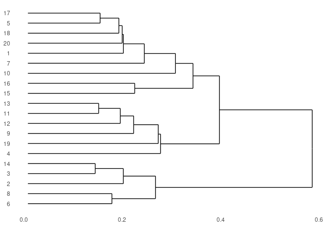
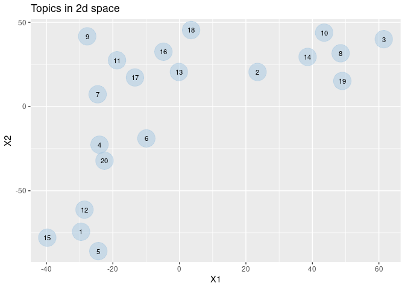

# PubmedMTK

***PubMed Mining Toolkit***

An R package for querying the PubMed database & parsing retrieved
records. Toolkit facilitates batch API requests, the creation of custom
corpora for NLP, and the quick exploration & visualization of topic
structure.

-   [Installation](#installation)
-   [Usage](#usage)
    -   [PubMed search](#pubmed-search)
    -   [Extract MeSH classifications](#extract-mesh-classifications)
    -   [MeSH annotations-based topic
        model](#mesh-annotations-based-topic-model)
    -   [Two-dimensional analyses](#two-dimensional-analyses)
-   [Tables](#tables)
    -   [MeSH vocabulary](#mesh-vocabulary)
    -   [PMC MeSH annotation
        frequencies](#pmc-mesh-annotation-frequencies)
    -   [Medline citation counts](#medline-citation-counts)

## Installation

``` r
devtools::install_github("jaytimm/PubmedMTK")
```

## Usage

### PubMed search

The `pmtk_search_pubmed()` function is meant for record-matching
searches typically performed using the [PubMed online
interface](https://pubmed.ncbi.nlm.nih.gov/). The `search_term`
parameter specifies the query term; the `fields` parameter can be used
to specify which fields to query.

``` r
s0 <- PubmedMTK::pmtk_search_pubmed(search_term = 'marijuana', 
                                    fields = c('TIAB','MH'))
```

    ## [1] "marijuana: 22004 records"

``` r
head(s0)
```

    ##    search_term     pmid
    ## 1:   marijuana 34074708
    ## 2:   marijuana 34074707
    ## 3:   marijuana 34073522
    ## 4:   marijuana 34060494
    ## 5:   marijuana 34058538
    ## 6:   marijuana 34058314

### Retrieve abstract data from PubMed

``` r
sen_df <- PubmedMTK::pmtk_get_records2(pmids = s0$pmid, 
                                       cores = 6, 
                                       ncbi_key = key) 

sen_df <- data.table::rbindlist(sen_df)
```

``` r
colnames(sen_df)
```

    ## [1] "pmid"         "year"         "articletitle" "meshHeadings" "chemNames"   
    ## [6] "keywords"     "abstract"

### Extract MeSH classifications

Subject terms/headings in metadata table include `MeSH` terms, as well
as (some) `keywords` & `chem-names`. The `pmtk_gather_mesh` function
extracts & structures these attributes from metadata. The resulting
table amounts to a document-term matrix (DTM), in which each PubMed
abstract is represented as a vector of MeSH terms.

``` r
m0 <- PubmedMTK::pmtk_gather_mesh(sen_df)
```

### MeSH annotations-based topic model

We can use these MeSH-based abstract representations to explore the
conceptual structure of a particular collection of PubMed records via
topic modeling. Here we implement **Latent Dirichlet allocation**, which
is a topic modeling algorithm that models *each document* in corpus as a
composite of topics, and *each topic* as a composite of terms. Topic
composition can be interpreted as sets of MeSH terms that frequently
co-occur.

``` r
as.text <- m0[, list(text = paste(term, collapse = " ")), by = pmid]
iter <- text2vec::itoken(as.text$text, ids = as.text$pmid)  
vocab <- text2vec::create_vocabulary(iter)

vocab0 <- text2vec::prune_vocabulary(
  vocab, 
  # doc_proportion_min = 0.0001,
  doc_proportion_max = 0.55,
  doc_count_min = 3) 

vectorizer <- text2vec::vocab_vectorizer(vocab0)
dtm <- text2vec::create_dtm(iter, vectorizer)
```

The `pmtk_summarize_lda` function summarizes and extracts topic
composition from the `text2vec::LDA` output. For each possible
topic-feature pair, the model computes the likelihood a given topic
generated a given feature. Output is filtered to the highest scoring
features per topic using the `topic_feats_n`.

``` r
lda <- text2vec::LDA$new(n_topics = 20) 
fit <- lda$fit_transform(dtm, progressbar = F)
```

    ## INFO  [08:39:03.738] early stopping at 170 iteration 
    ## INFO  [08:39:04.860] early stopping at 20 iteration

``` r
tm_summary <- PubmedMTK::pmtk_summarize_lda(
  lda = lda, topic_feats_n = 10)
```

#### Feature composition of first ten topics

| topic_id | topic_features                                                                                                                                                                                                                               |
|---------:|:---------------------------------------------------------------------------------------------------------------------------------------------------------------------------------------------------------------------------------------------|
|        1 | marijuana \| marijuana_use \| young_adult \| substance_use \| alcohol \| marijuana_smoking \| adolescents \| united_states \| tobacco \| adolescence                                                                                         |
|        2 | animals \| rats \| mice \| endocannabinoids \| receptors,\_cannabinoid \| receptor,\_cannabinoid,\_cb1 \| dronabinol \| cannabinoid_receptor_modulators \| receptors,\_drug \| brain                                                         |
|        3 | cannabis \| medical_marijuana \| legislation,\_drug \| drug_and_narcotic_control \| phytotherapy \| canada \| public_health \| health_policy \| chronic_pain \| united_kingdom                                                               |
|        4 | united_states \| substance-related_disorders \| male \| adolescent \| age_factors \| female \| socioeconomic_factors \| behavior \| adult \| crime                                                                                           |
|        5 | students \| alcohol_drinking \| substance-related_disorders \| sex_factors \| smoking \| adolescent \| universities \| male \| attitude \| age_factors                                                                                       |
|        6 | marijuana_abuse \| male \| adult \| comorbidity \| female \| mental_disorders \| depression \| alcoholism \| psychoses,\_substance-induced \| anxiety                                                                                        |
|        7 | dronabinol \| time_factors \| animals \| dose-response_relationship,\_drug \| heart_rate \| behavior,\_animal \| drug_interactions \| memory \| administration,\_oral \| drug_tolerance                                                      |
|        8 | cannabis \| male \| aggression \| tobacco \| seeds \| ethanol \| plants,\_toxic \| lung \| smoke \| perception                                                                                                                               |
|        9 | cannabis \| dronabinol \| cannabinoids \| gas_chromatography-mass_spectrometry \| chromatography,\_gas \| chromatography,\_thin_layer \| reproducibility_of_results \| chromatography,\_high_pressure_liquid \| mass_spectrometry \| methods |
|       10 | female \| pregnancy \| child \| smoking \| prospective_studies \| prenatal_exposure_delayed_effects \| infant,\_newborn \| case-control_studies \| longitudinal_studies \| pregnancy_complications                                           |

### Two-dimensional analyses

``` r
tmat <- tidytext::cast_sparse(data = tm_summary$topic_word_dist,
                              row = topic_id,
                              column = feature,
                              value = beta)

## build 2d data structures --
two_ds <- PubmedMTK::pmtk_2d(mat = tmat)
```

#### Hierarchical clustering

``` r
#two_ds$hc$labels <- tm_summary$topic_summary$topic_features
two_ds$hc %>% ggdendro::ggdendrogram(rotate=TRUE)
```



#### Principal component analysis (PCA)

``` r
two_ds$pca %>%
  ggplot(aes(x = X1,
             y = X2,
             label = topic_id)) +
  ggplot2::geom_point(size = 10, 
                      color = '#a5c8e1',
                      alpha = 0.5) +
  geom_text(size = 3) +
  ggtitle('Topics in 2d PCA space')
```



## Tables

### MeSH vocabulary

The package includes as a data frame the MeSH thesaurus &
hierarchically-organized vocabulary – comprised of 2021 versions of
`descriptor` & `trees` files made available via NLM-NIH. [A workflow for
re-creating the table from raw data
sets](https://github.com/jaytimm/PubmedMTK/blob/main/mds/build-MeSH-df.md).

``` r
PubmedMTK::pmtk_tbl_mesh
```

    ##         DescriptorUI          DescriptorName                 TermName code
    ##      1:      D000001              calcimycin               calcimycin    D
    ##      2:      D000001              calcimycin                  a-23187    D
    ##      3:      D000001              calcimycin                  a 23187    D
    ##      4:      D000001              calcimycin                   a23187    D
    ##      5:      D000001              calcimycin        antibiotic a23187    D
    ##     ---                                                                   
    ## 562296:      D066331 laser-evoked potentials   laser-evoked potential    G
    ## 562297:      D066331 laser-evoked potentials  potential, laser-evoked    G
    ## 562298:      D066331 laser-evoked potentials  potential, laser-evoked    G
    ## 562299:      D066331 laser-evoked potentials potentials, laser-evoked    G
    ## 562300:      D066331 laser-evoked potentials potentials, laser-evoked    G
    ##                            cats
    ##      1:     Chemicals and Drugs
    ##      2:     Chemicals and Drugs
    ##      3:     Chemicals and Drugs
    ##      4:     Chemicals and Drugs
    ##      5:     Chemicals and Drugs
    ##     ---                        
    ## 562296: Phenomena and Processes
    ## 562297: Phenomena and Processes
    ## 562298: Phenomena and Processes
    ## 562299: Phenomena and Processes
    ## 562300: Phenomena and Processes
    ##                                                      mesh1
    ##      1:                             Heterocyclic Compounds
    ##      2:                             Heterocyclic Compounds
    ##      3:                             Heterocyclic Compounds
    ##      4:                             Heterocyclic Compounds
    ##      5:                             Heterocyclic Compounds
    ##     ---                                                   
    ## 562296: Musculoskeletal and Neural Physiological Phenomena
    ## 562297:                            Physiological Phenomena
    ## 562298: Musculoskeletal and Neural Physiological Phenomena
    ## 562299:                            Physiological Phenomena
    ## 562300: Musculoskeletal and Neural Physiological Phenomena
    ##                                          mesh2           tree_location tree1
    ##      1:     Heterocyclic Compounds, Fused-Ring     D03.633.100.221.173   D03
    ##      2:     Heterocyclic Compounds, Fused-Ring     D03.633.100.221.173   D03
    ##      3:     Heterocyclic Compounds, Fused-Ring     D03.633.100.221.173   D03
    ##      4:     Heterocyclic Compounds, Fused-Ring     D03.633.100.221.173   D03
    ##      5:     Heterocyclic Compounds, Fused-Ring     D03.633.100.221.173   D03
    ##     ---                                                                     
    ## 562296: Nervous System Physiological Phenomena G11.561.200.500.400.500   G11
    ## 562297:         Electrophysiological Phenomena G07.265.216.500.400.500   G07
    ## 562298: Nervous System Physiological Phenomena G11.561.200.500.400.500   G11
    ## 562299:         Electrophysiological Phenomena G07.265.216.500.400.500   G07
    ## 562300: Nervous System Physiological Phenomena G11.561.200.500.400.500   G11
    ##           tree2
    ##      1: D03.633
    ##      2: D03.633
    ##      3: D03.633
    ##      4: D03.633
    ##      5: D03.633
    ##     ---        
    ## 562296: G11.561
    ## 562297: G07.265
    ## 562298: G11.561
    ## 562299: G07.265
    ## 562300: G11.561

### PMC MeSH annotation frequencies

``` r
PubmedMTK::pmtk_tbl_pmc_ref
```

    ##                  type                             term doc_count     doc_prop
    ##       1: meshHeadings                       algorithms     35621 1.963793e-02
    ##       2: meshHeadings           crystallography,_x-ray      6384 3.519512e-03
    ##       3: meshHeadings data_interpretation,_statistical      3216 1.772987e-03
    ##       4: meshHeadings                 fourier_analysis       472 2.602145e-04
    ##       5: meshHeadings              molecular_structure      8696 4.794122e-03
    ##      ---                                                                     
    ## 1304693: meshHeadings         tricuspid_valve_stenosis         1 5.513020e-07
    ## 1304694: meshHeadings                    ethylestrenol         1 5.513020e-07
    ## 1304695:    chemNames         monoethylglycinexylidide         1 5.513020e-07
    ## 1304696:    chemNames                           savlon         1 5.513020e-07
    ## 1304697:    chemNames            7-propyl_spirolactone         1 5.513020e-07

### Medline citation counts

``` r
PubmedMTK::pmtk_tbl_citations
```

    ##           year  total    usa
    ##  1: 1947-01-01  62869     NA
    ##  2: 1948-01-01  68711     NA
    ##  3: 1949-01-01  60931     NA
    ##  4: 1950-01-01  84099     NA
    ##  5: 1951-01-01 102578     NA
    ##  6: 1952-01-01 106850     NA
    ##  7: 1953-01-01 107678     NA
    ##  8: 1954-01-01 104007     NA
    ##  9: 1955-01-01 106760     NA
    ## 10: 1956-01-01 105228     NA
    ## 11: 1957-01-01 109811     NA
    ## 12: 1958-01-01 107655     NA
    ## 13: 1959-01-01 107792     NA
    ## 14: 1960-01-01 108862     NA
    ## 15: 1961-01-01 117003     NA
    ## 16: 1962-01-01 122645     NA
    ## 17: 1963-01-01 137734     NA
    ## 18: 1964-01-01 158922  48007
    ## 19: 1965-01-01 173136  52211
    ## 20: 1966-01-01 175197  53251
    ## 21: 1967-01-01 186846  55734
    ## 22: 1968-01-01 203701  60711
    ## 23: 1969-01-01 210438  63482
    ## 24: 1970-01-01 211330  63806
    ## 25: 1971-01-01 216614  65921
    ## 26: 1972-01-01 222237  69590
    ## 27: 1973-01-01 225871  74089
    ## 28: 1974-01-01 229807  77282
    ## 29: 1975-01-01 244105  82956
    ## 30: 1976-01-01 249180  87105
    ## 31: 1977-01-01 255745  91627
    ## 32: 1978-01-01 265555  96916
    ## 33: 1979-01-01 274279 103545
    ## 34: 1980-01-01 272538 104572
    ## 35: 1981-01-01 274481 106472
    ## 36: 1982-01-01 285221 112363
    ## 37: 1983-01-01 299016 118328
    ## 38: 1984-01-01 307931 122777
    ## 39: 1985-01-01 318108 126919
    ## 40: 1986-01-01 330455 133524
    ## 41: 1987-01-01 347998 141190
    ## 42: 1988-01-01 365610 150036
    ## 43: 1989-01-01 381394 156654
    ## 44: 1990-01-01 388150 163476
    ## 45: 1991-01-01 388767 168094
    ## 46: 1992-01-01 391804 173562
    ## 47: 1993-01-01 398113 178930
    ## 48: 1994-01-01 407320 185636
    ## 49: 1995-01-01 416476 191146
    ## 50: 1996-01-01 421840 192566
    ## 51: 1997-01-01 432077 198148
    ## 52: 1998-01-01 446844 203691
    ## 53: 1999-01-01 459801 210542
    ## 54: 2000-01-01 485494 221990
    ## 55: 2001-01-01 505769 231049
    ## 56: 2002-01-01 521687 236554
    ## 57: 2003-01-01 549305 249009
    ## 58: 2004-01-01 579038 260288
    ## 59: 2005-01-01 609839 273330
    ## 60: 2006-01-01 634565 281453
    ## 61: 2007-01-01 657654 287209
    ## 62: 2008-01-01 685937 298734
    ## 63: 2009-01-01 707729 306062
    ## 64: 2010-01-01 735007 315215
    ## 65: 2011-01-01 769281 330185
    ## 66: 2012-01-01 811160 348797
    ## 67: 2013-01-01 854133 365220
    ## 68: 2014-01-01 871030 369552
    ## 69: 2015-01-01 878432 366736
    ## 70: 2016-01-01 862744 350671
    ## 71: 2017-01-01 848229 343161
    ## 72: 2018-01-01 857322 339199
    ## 73: 2019-01-01 865068 334305
    ## 74: 2020-01-01 871672 329411
    ## 75: 2021-01-01 877300 324518
    ##           year  total    usa
