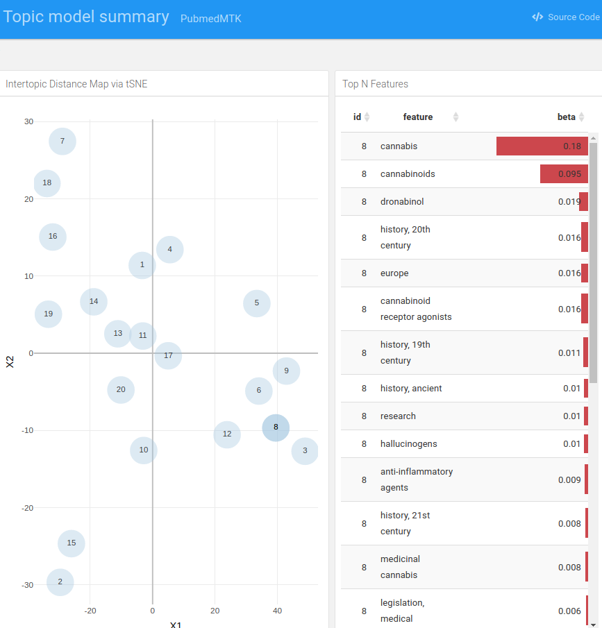

# PubmedMTK

PubMed Mining Toolkit:: An R package for querying the PubMed database &
parsing retrieved records. Toolkit facilitates batch API requests, the
creation of custom corpora for NLP, and the quick exploration &
visualization of topic structure.

-   [Installation](#installation)
-   [Usage](#usage)
    -   [PubMed search](#pubmed-search)
    -   [Retrieve and parse abstract
        data](#retrieve-and-parse-abstract-data)
    -   [KWIC search](#kwic-search)
    -   [Extract MeSH classifications](#extract-mesh-classifications)
    -   [MeSH annotations-based topic
        model](#mesh-annotations-based-topic-model)
    -   [Two-dimensional analyses](#two-dimensional-analyses)
-   [Interactive HTML topic summary](#interactive-html-topic-summary)
-   [Tables](#tables)
    -   [MeSH vocabulary](#mesh-vocabulary)
    -   [PMC MeSH annotation
        frequencies](#pmc-mesh-annotation-frequencies)
-   [Contributing](#contributing)

## Installation

``` r
devtools::install_github("jaytimm/PubmedMTK")
```

## Usage

### PubMed search

The `pmtk_search_pubmed()` function is meant for record-matching
searches typically performed using the [PubMed online
interface](https://pubmed.ncbi.nlm.nih.gov/). The `search_term`
parameter specifies the query term; the `fields` parameter can be used
to specify which fields to query.

``` r
s0 <- PubmedMTK::pmtk_search_pubmed(search_term = 'medical marijuana', 
                                    fields = c('TIAB','MH'))
```

    ## [1] "medical marijuana[TIAB] OR medical marijuana[MH]: 2134 records"

``` r
head(s0)
```

    ##          search_term     pmid
    ## 1: medical marijuana 34128629
    ## 2: medical marijuana 34109050
    ## 3: medical marijuana 34082823
    ## 4: medical marijuana 34044753
    ## 5: medical marijuana 34007062
    ## 6: medical marijuana 33998880

### Retrieve and parse abstract data

For quicker abstract retrieval, be sure to get an [API
key](https://support.nlm.nih.gov/knowledgebase/article/KA-03521/en-us).

``` r
sen_df <- PubmedMTK::pmtk_get_records2(pmids = s0$pmid, 
                                       cores = 6, 
                                       ncbi_key = key) 
```

> Sample record from output:

``` r
sen_df <- data.table::rbindlist(sen_df)

n <- 12
list(pmid = sen_df$pmid[n],
     year = sen_df$year[n],
     articletitle = strwrap(sen_df$articletitle[n], width = 60),
     meshHeadings = strwrap(sen_df$meshHeadings[n], width = 60),
     text = strwrap(sen_df$abstract[n], width = 60)[1:10])
```

    ## $pmid
    ## [1] "33933061"
    ## 
    ## $year
    ## [1] "2021"
    ## 
    ## $articletitle
    ## [1] "Opioid use in medical cannabis authorization adult patients"
    ## [2] "from 2013 to 2018: Alberta, Canada."                        
    ## 
    ## $meshHeadings
    ## [1] "Adult|Alberta|Analgesics,"                                  
    ## [2] "Opioid|Cannabis|Female|Humans|Male|Medical Marijuana|Middle"
    ## [3] "Aged|Opioid-Related Disorders|United States"                
    ## 
    ## $text
    ##  [1] "The opioid overdose epidemic in Canada and the United"      
    ##  [2] "States has become a public health crisis - with exponential"
    ##  [3] "increases in opioid-related morbidity and mortality."       
    ##  [4] "Recently, there has been an increasing body of evidence"    
    ##  [5] "focusing on the opioid-sparing effects of medical cannabis" 
    ##  [6] "use (reduction of opioid use and reliance), and medical"    
    ##  [7] "cannabis as a potential alternative treatment for chronic"  
    ##  [8] "pain. The objective of this study is to assess the effect"  
    ##  [9] "of medical cannabis authorization on opioid use (oral"      
    ## [10] "morphine equivalent; OME) between 2013 and 2018 in Alberta,"

### KWIC search

The `pmtk_locate_search()` function allows for quick keyword-in-context
(KWIC) search. A simple wrapper of the `corpus::text_locate` function.

``` r
toks <-  corpus::text_tokens(sen_df$abstract)

egs <- PubmedMTK::pmtk_locate_search(text = toks,
                                     doc_id = sen_df$pmid,
                                     search = c('medical marijuana laws'),
                                     stem = F,
                                     window = 10)

egs$t1 <- paste0('... ', egs$lhs, ' `', egs$instance, '` ', egs$rhs, ' ...')
knitr::kable(egs[1:8, c(1,5)])
```

| doc_id   | t1                                                                                                                                                                         |
|:---------|:---------------------------------------------------------------------------------------------------------------------------------------------------------------------------|
| 34128629 | … , and driving . physicians can recommend use of marijuana under `medical marijuana laws` but cannot prescribe it , as it is classified as a …                            |
| 33750275 | … moving to reverse marijuana prohibition , most frequently through legalization of `medical marijuana laws` ( mmls ) , and there is concern that marijuana legalization … |
| 33730400 | … recreational marijuana laws ( rml ) , followed by states with `medical marijuana laws` ( mml ) and without legal cannabis use , respectively . …                         |
| 33624387 | … differences-in-differences ( dd ) approach and found that the implementation of `medical marijuana laws` ( mmls ) and recreational marijuana laws ( rmls ) reduced …     |
| 33143941 | … . cannabis legalization was determined by the presence or absence of `medical marijuana laws` ( mml ) and recreational marijuana laws ( rml ) in …                       |
| 33069561 | … , a limited but growing body of literature has found state `medical marijuana laws` ( mmls ) to be associated with lower levels of opioid …                              |
| 32799573 | … management , much research has since focused on the potential for `medical marijuana laws` ( mmls ) to curb the opioid epidemic . nonetheless , …                        |
| 32736294 | … cannabis use disorder are more prevalent in u.s . states with `medical marijuana laws` ( mmls ) , as well as among individuals with elevated …                           |

### Extract MeSH classifications

Subject terms/headings in metadata table include `MeSH` terms, as well
as (some) `keywords` & `chem-names`. The `pmtk_gather_mesh` function
extracts & structures these attributes from metadata.

``` r
m0 <- PubmedMTK::pmtk_gather_mesh(sen_df)
```

### MeSH annotations-based topic model

We can use these MeSH-based abstract representations to explore the
conceptual structure of a particular collection of PubMed records via
topic modeling. Here we implement **Latent Dirichlet allocation**, which
is a topic modeling algorithm that models *each document* in corpus as a
composite of topics, and *each topic* as a composite of terms.

``` r
as.text <- m0[, list(text = paste(term, collapse = " ")), by = pmid]
iter <- text2vec::itoken(as.text$text, ids = as.text$pmid)  
vocab <- text2vec::create_vocabulary(iter)

vocab0 <- text2vec::prune_vocabulary(
  vocab, 
  # doc_proportion_min = 0.0001,
  doc_proportion_max = 0.55,
  doc_count_min = 3) 

vectorizer <- text2vec::vocab_vectorizer(vocab0)
dtm <- text2vec::create_dtm(iter, vectorizer)
```

The `pmtk_summarize_lda` function summarizes and extracts topic
composition from the `text2vec::LDA` output.

``` r
lda <- text2vec::LDA$new(n_topics = 20) 
fit <- lda$fit_transform(dtm, progressbar = F)
```

    ## INFO  [09:53:08.957] early stopping at 100 iteration 
    ## INFO  [09:53:09.312] early stopping at 30 iteration

``` r
tm_summary <- PubmedMTK::pmtk_summarize_lda(
  lda = lda, topic_feats_n = 10)
```

#### Feature composition of first ten topics

| topic_id | topic_features                                                                                                                                                                                                                                  |
|---------:|:------------------------------------------------------------------------------------------------------------------------------------------------------------------------------------------------------------------------------------------------|
|        1 | medical_cannabis \| canada \| cannabis \| marijuana_smoking \| public_health \| united_states \| practice_patterns,\_physicians’ \| evidence-based_medicine \| mental_health \| substance_use                                                   |
|        2 | female \| adult \| male \| cross-sectional_studies \| young_adult \| middle_aged \| surveys_and_questionnaires \| adolescent \| health_surveys \| comorbidity                                                                                   |
|        3 | cannabis \| legislation,\_drug \| endocannabinoids \| hiv_infections \| public_policy \| practice_guidelines_as_topic \| politics \| male \| san_francisco \| treatment_outcome                                                                 |
|        4 | united_states \| drug_and_narcotic_control \| state_government \| government_regulation \| federal_government \| health_policy \| risk_assessment \| united_states_food_and_drug_administration \| physician-patient_relations \| policy_making |
|        5 | male \| female \| child \| adolescent \| adult \| anticonvulsants \| child,\_preschool \| infant \| drug_resistant_epilepsy \| safety                                                                                                           |
|        6 | cannabidiol \| dronabinol \| epilepsy \| cbd \| animals \| nabiximols \| seizures \| drug_combinations \| cannabinoid_receptor_agonists \| endocannabinoid_system                                                                               |
|        7 | chronic_pain \| analgesics,\_opioid \| opioid-related_disorders \| middle_aged \| adult \| male \| substance-related_disorders \| drug_prescriptions \| israel \| prescription_drugs                                                            |
|        8 | adult \| female \| male \| marijuana \| substance-related_disorders \| hallucinogens \| cognition \| marijuana_use \| longitudinal_studies \| time_factors                                                                                      |
|        9 | united_states \| drug_and_narcotic_control \| marijuana_smoking \| phytotherapy \| california \| commerce \| politics \| physicians \| terminal_care \| biomedical_research                                                                     |
|       10 | marijuana_use \| female \| prevalence \| adolescent \| united_states \| age_factors \| illicit_drugs \| medical_marijuana_laws \| alcohol_drinking \| sex_factors                                                                               |

### Two-dimensional analyses

``` r
tmat <- tidytext::cast_sparse(data = tm_summary$topic_word_dist,
                              row = topic_id,
                              column = feature,
                              value = beta)

two_ds <- PubmedMTK::pmtk_2d(mat = tmat, seed = 99)
```

``` r
two_ds$tsne %>%
  ggplot(aes(x = X1,
             y = X2,
             label = topic_id)) +
  ggplot2::geom_point(size = 10, 
                      color = '#a5c8e1',
                      alpha = 0.5) +
  geom_text(size = 3) +
  ggtitle('Topics in 2d space')
```


## Interactive HTML topic summary

``` r
PubmedMTK::pmtk_build_interactive(pmtk_lda = tm_summary,
                                  pmtk_2d = two_ds,
                                  out_dir = '/home/jtimm/Desktop/',
                                  file_name = 'party.html')
```



## Tables

### MeSH vocabulary

The package includes as a data frame the MeSH thesaurus &
hierarchically-organized vocabulary – comprised of 2021 versions of
`descriptor` & `trees` files made available via NLM-NIH. [A
workflow](https://github.com/jaytimm/PubmedMTK/blob/main/mds/build-MeSH-df.md)
for re-creating the table from raw data sets.

``` r
PubmedMTK::pmtk_tbl_mesh[1:5, c(1:3, 5:6)]
```

    ##    DescriptorUI DescriptorName          TermName                cats
    ## 1:      D000001     calcimycin        calcimycin Chemicals and Drugs
    ## 2:      D000001     calcimycin           a-23187 Chemicals and Drugs
    ## 3:      D000001     calcimycin           a 23187 Chemicals and Drugs
    ## 4:      D000001     calcimycin            a23187 Chemicals and Drugs
    ## 5:      D000001     calcimycin antibiotic a23187 Chemicals and Drugs
    ##                     mesh1
    ## 1: Heterocyclic Compounds
    ## 2: Heterocyclic Compounds
    ## 3: Heterocyclic Compounds
    ## 4: Heterocyclic Compounds
    ## 5: Heterocyclic Compounds

### PMC MeSH annotation frequencies

MeSH annotation frequencies for the Open Access Common Use portion of
PMC. Frequencies based on roughly 1.8 million PubMed records. Details
[here](https://github.com/jaytimm/PubmedMTK/blob/main/mds/pmc-reference.md).

``` r
PubmedMTK::pmtk_tbl_pmc_ref
```

    ##                  type                             term doc_count     doc_prop
    ##       1: meshHeadings                       algorithms     35621 1.963793e-02
    ##       2: meshHeadings           crystallography,_x-ray      6384 3.519512e-03
    ##       3: meshHeadings data_interpretation,_statistical      3216 1.772987e-03
    ##       4: meshHeadings                 fourier_analysis       472 2.602145e-04
    ##       5: meshHeadings              molecular_structure      8696 4.794122e-03
    ##      ---                                                                     
    ## 1304693: meshHeadings         tricuspid_valve_stenosis         1 5.513020e-07
    ## 1304694: meshHeadings                    ethylestrenol         1 5.513020e-07
    ## 1304695:    chemNames         monoethylglycinexylidide         1 5.513020e-07
    ## 1304696:    chemNames                           savlon         1 5.513020e-07
    ## 1304697:    chemNames            7-propyl_spirolactone         1 5.513020e-07

## Contributing

The project maintainer welcomes contributions in the form of feature
requests, bug reports, comments, unit tests, vignettes, or other code.
If you’d like to contribute, either:

-   fork the repository and submit a [pull
    request](https://github.com/jaytimm/PubmedMTK/pulls);

-   file an [issue](https://github.com/jaytimm/PubmedMTK/issues);

-   or contact the maintainer via e-mail.

Thanks!
